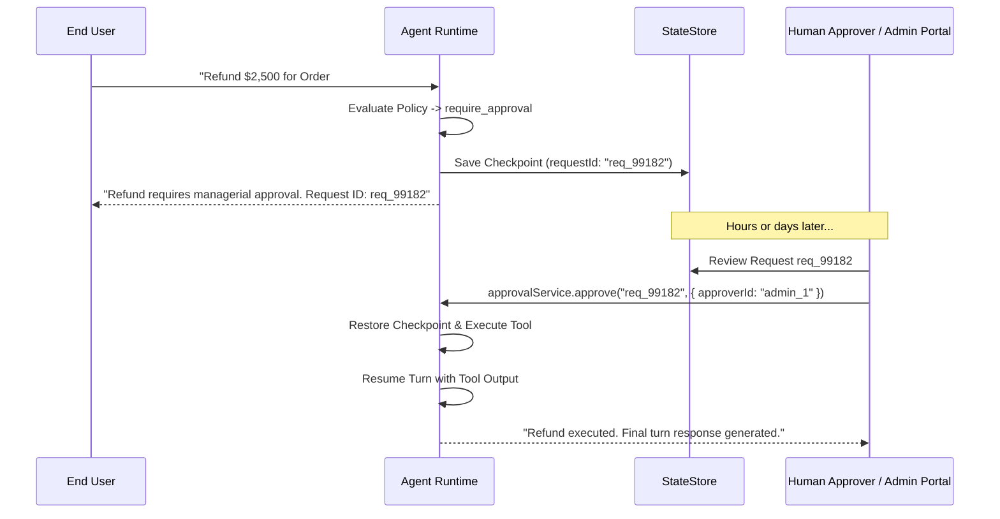

## Overview

When a policy evaluates to `require_approval`, the agent runtime suspends the active turn without holding open an active HTTP connection or Node.js event loop thread.

The complete execution state (conversation history, pending tool closure, model parameters, security context) is serialized into an `ApprovalRequest` record within the configured `StateStore`.

---

## The Approval Flow



---

## Approving or Rejecting Requests

Inject `ApprovalService` into your admin controllers:

```typescript
// src/admin/approvals.controller.ts
import { Controller, Post, Param, Body, UseGuards } from '@nestjs/common';
import { ApprovalService } from 'nestjs-agentic';

@Controller('admin/approvals')
export class ApprovalsController {
  constructor(private readonly approvalService: ApprovalService) {}

  @Post(':id/approve')
  async approveRequest(
    @Param('id') requestId: string,
    @Body('approverId') approverId: string,
  ) {
    const result = await this.approvalService.approve(requestId, {
      approverId,
      approvedAt: new Date(),
    });

    return {
      status: 'approved',
      finalAgentAnswer: result.content,
      tokensUsed: result.usage.totalTokens,
    };
  }

  @Post(':id/reject')
  async rejectRequest(
    @Param('id') requestId: string,
    @Body('reason') reason: string,
    @Body('approverId') approverId: string,
  ) {
    const result = await this.approvalService.reject(requestId, {
      reason,
      approverId,
    });

    return {
      status: 'rejected',
      finalAgentAnswer: result.content,
    };
  }
}
```

---

## Approver Authorization

By default the framework records *who* settled an approval but does not enforce that they were entitled to. Register an `ApprovalAuthorizer` through the `APPROVAL_AUTHORIZER` token to gate settlement:

```typescript
import { APPROVAL_AUTHORIZER } from '@nestjs-agentic/core';
import type { ApprovalAuthorizer, AuditActor, PendingApproval } from '@nestjs-agentic/core';

class MaintainerOnlyAuthorizer implements ApprovalAuthorizer {
  async canSettle(approval: PendingApproval, actor?: AuditActor) {
    if (!actor?.roles?.includes('finance_officer')) {
      return { allowed: false, reason: 'approver lacks finance_officer entitlement' };
    }
    return true;
  }
}

// providers: [{ provide: APPROVAL_AUTHORIZER, useClass: MaintainerOnlyAuthorizer }]
```

The check runs **before** the approval is claimed, so a refused attempt raises `ApprovalNotAuthorizedError` and leaves the approval pending for a properly authorized reviewer — an unauthorized caller cannot destroy a pending decision. Every refusal is recorded as an `approval_settlement_denied` audit event, so repeated attempts on one approval are visible.

### Separation of duties

Enable `approvals.enforceSeparationOfDuties` to stop the identity that triggered an action from also approving it:

```typescript
AgenticModule.forRoot({
  defaultModel: { provider: 'openai', model: 'gpt-4o' },
  approvals: { enforceSeparationOfDuties: true },
});
```

The requester is captured on the approval as `requestedBy` when the approval is created. A settlement is only refused on a **proven** conflict — both identities known and equal. A missing identity on either side cannot be shown to be the same person, so it is not treated as a violation; use an `ApprovalAuthorizer` if unidentified settlements must be blocked outright.
