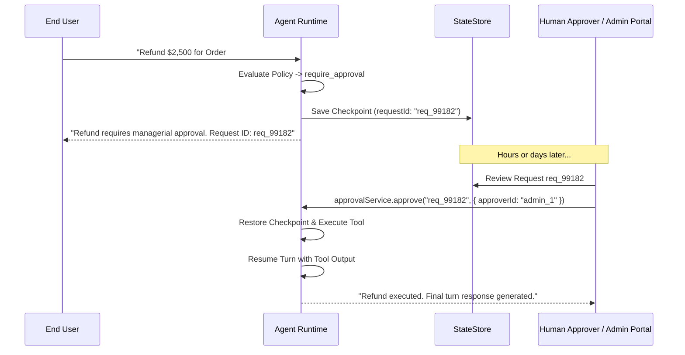

## Overview

When a policy evaluates to `require_approval`, the agent runtime suspends the active turn without holding open an active HTTP connection or Node.js event loop thread.

The complete execution state (conversation history, pending tool closure, model parameters, security context) is serialized into an `ApprovalRequest` record within the configured `StateStore`.

---

## The Approval Flow



---

## Approving or Rejecting Requests

Inject `ApprovalService` into your admin controllers:

```typescript
// src/admin/approvals.controller.ts
import { Controller, Post, Param, Body, UseGuards } from '@nestjs/common';
import { ApprovalService } from 'nestjs-agentic';

@Controller('admin/approvals')
export class ApprovalsController {
  constructor(private readonly approvalService: ApprovalService) {}

  @Post(':id/approve')
  async approveRequest(
    @Param('id') requestId: string,
    @Body('approverId') approverId: string,
  ) {
    const result = await this.approvalService.approve(requestId, {
      approverId,
      approvedAt: new Date(),
    });

    return {
      status: 'approved',
      finalAgentAnswer: result.content,
      tokensUsed: result.usage.totalTokens,
    };
  }

  @Post(':id/reject')
  async rejectRequest(
    @Param('id') requestId: string,
    @Body('reason') reason: string,
    @Body('approverId') approverId: string,
  ) {
    const result = await this.approvalService.reject(requestId, {
      reason,
      approverId,
    });

    return {
      status: 'rejected',
      finalAgentAnswer: result.content,
    };
  }
}
```

---

## Approver Authorization

By default the framework records *who* settled an approval but does not enforce that they were entitled to. Supply an `ApprovalAuthorizer` to gate settlement:

```typescript
import type { ApprovalAuthorizer, AuditActor, PendingApproval } from '@nestjs-agentic/core';

class MaintainerOnlyAuthorizer implements ApprovalAuthorizer {
  async canSettle(approval: PendingApproval, actor?: AuditActor) {
    if (!actor?.roles?.includes('finance_officer')) {
      return { allowed: false, reason: 'approver lacks finance_officer entitlement' };
    }
    return true;
  }
}

```

Register it through `forRoot`. `ApprovalService` is instantiated inside `AgenticModule`, so a provider declared in your own module's `providers` array is **not** visible to it — pass the authorizer as an option instead:

```typescript
@Module({
  imports: [
    AgenticModule.forRoot({
      defaultModel: { provider: 'openai', model: 'gpt-4o' },
      approvalAuthorizer: new MaintainerOnlyAuthorizer(),
      approvals: { enforceSeparationOfDuties: true, enforceTenantIsolation: true },
    }),
  ],
})
export class AppModule {}
```

If your authorizer needs its own injected dependencies, construct it in a factory module and pass the instance here, the same way `approvalStore` and `auditSinks` are supplied.

The check runs **before** the approval is claimed, so a refused attempt raises `ApprovalNotAuthorizedError` and leaves the approval pending for a properly authorized reviewer — an unauthorized caller cannot destroy a pending decision. Every refusal is recorded as an `approval_settlement_denied` audit event, so repeated attempts on one approval are visible.

### The `actor` is not authenticated by the framework

`ApprovalService` is a service, not an HTTP boundary — it has no request context and cannot verify identity. Whatever your code passes as `actor` is taken at face value by the authorizer, separation-of-duties, and tenant checks.

Derive it from an already-authenticated principal, typically in a NestJS guard:

```typescript
@Post('approvals/:id/approve')
@UseGuards(JwtAuthGuard)
async approve(@Param('id') id: string, @Req() req: AuthenticatedRequest) {
  // From the verified token — never from the request body.
  return this.approvals.approve(id, {
    actor: { userId: req.user.sub, tenantId: req.user.tenantId, roles: req.user.roles },
  });
}
```

Passing client-supplied values here would let a caller claim any identity and defeat every check below.

### Separation of duties

Enable `approvals.enforceSeparationOfDuties` to stop the identity that triggered an action from also approving it. The requester is captured on the approval as `requestedBy` at creation.

A settlement is refused only on a **proven** conflict: both `userId`s known, equal, and in the same tenant. The tenant scoping matters — an `admin` in two different tenants is two different people. A missing identity cannot be shown to be the same person, so it is not treated as a violation.

### Tenant isolation

In a multi-tenant deployment, enable `approvals.enforceTenantIsolation` so a leaked approval ID cannot be settled from another tenant:

```typescript
approvals: { enforceTenantIsolation: true }
```

Both checks fail closed on an unknown tenant, in opposite directions — an unproven match is never read as permission, and an unproven difference is never read as separation:

- **Tenant isolation** refuses when the approver's `tenantId` differs from the approval's, when the approver supplies none, or when the *approval itself* carries none (an untenanted approval cannot be shown to belong to the caller's tenant).
- **Separation of duties** clears a matching `userId` only when the two tenants are *provably different*. If either side's tenant is unknown, a matching `userId` is still treated as the same person.

### Failing closed

Both checks above are opt-in, and with no authorizer registered any caller holding an approval ID can settle it — the pre-existing behavior, kept for backward compatibility. To require an authorization boundary instead, enable strict mode:

```typescript
approvals: { requireAuthorizer: true }
```

Every settlement is then refused unless an `ApprovalAuthorizer` is registered, so a misconfigured deployment fails closed rather than silently ungoverned.
