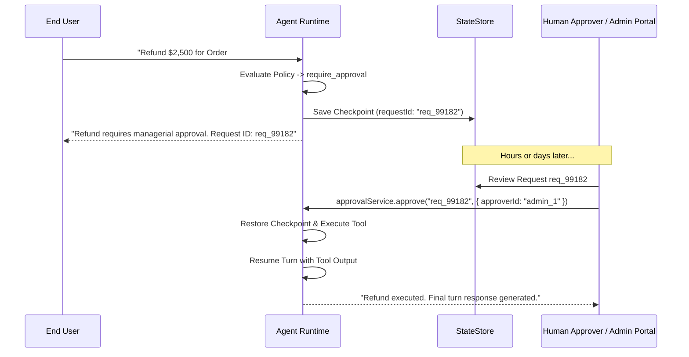

## Overview

When a policy evaluates to `require_approval`, the agent runtime suspends the active turn without holding open an active HTTP connection or Node.js event loop thread.

The complete execution state (conversation history, pending tool closure, model parameters, security context) is serialized into an `ApprovalRequest` record within the configured `StateStore`.

---

## The Approval Flow


```mermaid
sequenceDiagram
    participant User as End User
    participant Agent as Agent Runtime
    participant Store as StateStore
    participant Admin as Human Approver / Admin Portal

    User->>Agent: "Refund $2,500 for Order #8821"
    Agent->>Agent: Evaluate Policy -> require_approval
    Agent->>Store: Save Checkpoint (requestId: "req_99182")
    Agent-->>User: "Refund requires managerial approval. Request ID: req_99182"
    
    Note over Admin,Store: Hours or days later...
    Admin->>Store: Review Request req_99182
    Admin->>Agent: approvalService.approve("req_99182", { approverId: "admin_1" })
    Agent->>Agent: Restore Checkpoint & Execute Tool
    Agent->>Agent: Resume Turn with Tool Output
    Agent-->>Admin: "Refund executed. Final turn response generated."
```

---

## Approving or Rejecting Requests

Inject `ApprovalService` into your admin controllers:

```typescript
// src/admin/approvals.controller.ts
import { Controller, Post, Param, Body, UseGuards } from '@nestjs/common';
import { ApprovalService } from 'nestjs-agentic';

@Controller('admin/approvals')
export class ApprovalsController {
  constructor(private readonly approvalService: ApprovalService) {}

  @Post(':id/approve')
  async approveRequest(
    @Param('id') requestId: string,
    @Body('approverId') approverId: string,
  ) {
    const result = await this.approvalService.approve(requestId, {
      approverId,
      approvedAt: new Date(),
    });

    return {
      status: 'approved',
      finalAgentAnswer: result.content,
      tokensUsed: result.usage.totalTokens,
    };
  }

  @Post(':id/reject')
  async rejectRequest(
    @Param('id') requestId: string,
    @Body('reason') reason: string,
    @Body('approverId') approverId: string,
  ) {
    const result = await this.approvalService.reject(requestId, {
      reason,
      approverId,
    });

    return {
      status: 'rejected',
      finalAgentAnswer: result.content,
    };
  }
}
```

---

## Approver Authorization

By default the framework records *who* settled an approval but does not enforce that they were entitled to. Supply an `ApprovalAuthorizer` to gate settlement:

```typescript
import type { ApprovalAuthorizer, AuditActor, PendingApproval } from '@nestjs-agentic/core';

class MaintainerOnlyAuthorizer implements ApprovalAuthorizer {
  async canSettle(approval: PendingApproval, actor?: AuditActor) {
    if (!actor?.roles?.includes('finance_officer')) {
      return { allowed: false, reason: 'approver lacks finance_officer entitlement' };
    }
    return true;
  }
}

```

Register it through `forRoot`. `ApprovalService` is instantiated inside `AgenticModule`, so a provider declared in your own module's `providers` array is **not** visible to it — pass the authorizer as an option instead. Use `useClass` so Nest constructs it and its own dependencies are injected normally:

```typescript
@Module({
  imports: [
    AgenticModule.forRoot({
      defaultModel: { provider: 'openai', model: 'gpt-4o' },
      approvalAuthorizer: { useClass: MaintainerOnlyAuthorizer },
      approvals: { enforceSeparationOfDuties: true, enforceTenantIsolation: true },
    }),
  ],
})
export class AppModule {}
```

`useFactory` is available when the authorizer needs explicit wiring:

```typescript
approvalAuthorizer: {
  useFactory: (users: UserDirectory) => new MaintainerOnlyAuthorizer(users),
  inject: [UserDirectory],
}
```

The factory runs inside `AgenticModule`, so each `inject` token must be resolvable **from that module's scope** — a provider declared only in your `AppModule` is not. Export it from a `@Global()` module (or one `AgenticModule` can see) before injecting it:

```typescript
@Global()
@Module({ providers: [UserDirectory], exports: [UserDirectory] })
export class IdentityModule {}
```

The same applies to `useClass`: the authorizer's own constructor dependencies are resolved in `AgenticModule`'s scope. If wiring it that way is awkward, construct the authorizer yourself in your module and pass the instance instead — it is the one form with no scope requirement.

A bare instance (`approvalAuthorizer: new MaintainerOnlyAuthorizer()`) is also accepted, but it is constructed outside the container — use it only for an authorizer that needs nothing injected.

The check runs **before** the approval is claimed, so a refused attempt raises `ApprovalNotAuthorizedError` and leaves the approval pending for a properly authorized reviewer — an unauthorized caller cannot destroy a pending decision.

Each refusal is recorded as an `approval_settlement_denied` audit event, which makes repeated attempts on one approval visible — but only when auditing is configured. Auditing is opt-in: with no sink registered, `AuditTrail` records nothing. Register at least one to keep the trail:

```typescript
AgenticModule.forRoot({
  defaultModel: { provider: 'openai', model: 'gpt-4o' },
  auditSinks: [new ConsoleAuditSink()],
});
```

### The `actor` is not authenticated by the framework

`ApprovalService` is a service, not an HTTP boundary — it has no request context and cannot verify identity. Whatever your code passes as `actor` is taken at face value by the authorizer, separation-of-duties, and tenant checks.

Derive it from an already-authenticated principal, typically in a NestJS guard:

```typescript
@Post('approvals/:id/approve')
@UseGuards(JwtAuthGuard)
async approve(@Param('id') id: string, @Req() req: AuthenticatedRequest) {
  // From the verified token — never from the request body.
  return this.approvals.approve(id, {
    actor: { userId: req.user.sub, tenantId: req.user.tenantId, roles: req.user.roles },
  });
}
```

Passing client-supplied values here would let a caller claim any identity and defeat every check below.

### Separation of duties

Enable `approvals.enforceSeparationOfDuties` to stop the identity that triggered an action from also approving it. The requester is captured on the approval as `requestedBy` at creation.

Matching `userId`s are treated as a conflict **unless the two tenants are provably different** — an `admin` in two different tenants is two different people, but an unknown tenant on either side is not proof of that. A settlement is only refused when both `userId`s are known and equal; a missing `userId` cannot be shown to be the same person, so it is not treated as a violation.

### Tenant isolation

In a multi-tenant deployment, enable `approvals.enforceTenantIsolation` so a leaked approval ID cannot be settled from another tenant:

```typescript
approvals: { enforceTenantIsolation: true }
```

Both checks fail closed on an unknown tenant, in opposite directions — an unproven match is never read as permission, and an unproven difference is never read as separation:

- **Tenant isolation** refuses when the approver's `tenantId` differs from the approval's, when the approver supplies none, or when the *approval itself* carries none (an untenanted approval cannot be shown to belong to the caller's tenant).
- **Separation of duties** clears a matching `userId` only when the two tenants are *provably different*. If either side's tenant is unknown, a matching `userId` is still treated as the same person.

### Failing closed

Both checks above are opt-in. Without an authorizer, a caller holding an approval ID can settle it as long as every *enabled* governance check passes — with none enabled, that is the pre-existing behavior, kept for backward compatibility. To require an authorization boundary instead, enable strict mode:

```typescript
approvals: { requireAuthorizer: true }
```

Every settlement is then refused unless an `ApprovalAuthorizer` is registered, so a misconfigured deployment fails closed rather than silently ungoverned.

---

## Dual Control (N-of-M Approvals)

High-risk actions often need more than one reviewer. A policy asks for that by returning `requiredApprovals` on its `require_approval` decision:

```typescript
class WireTransferPolicy implements ToolPolicy {
  async evaluate(ctx: AgentContext, toolName: string, args: Record<string, unknown>): Promise<PolicyResult> {
    if (Number(args.amount) > 100_000) {
      return { decision: 'require_approval', reason: 'Large wires need two treasury officers.', requiredApprovals: 2 };
    }
    return { decision: 'allow' };
  }
}
```

The withheld tool runs only after that many **distinct** approvers have signed off. Each reviewer calls `approve()` as usual:

```typescript
const first = await approvals.approve(id, { actor: { userId: 'alice', tenantId: 'bank' } });
// { success: false, status: 'pending_approval', signatures: 1, requiredApprovals: 2, ... }

const final = await approvals.approve(id, { actor: { userId: 'bob', tenantId: 'bank' } });
// The tool runs and the turn resumes, exactly as with a single approver.
```

What the framework guarantees:

- **Distinct people, not repeated calls.** Signatures are told apart by `actor.userId`. A second signature from the same `userId` throws `ApprovalNotAuthorizedError` and is not counted, whatever its tenant or roles. A signature without a `userId` is refused, because it cannot be shown to come from a different person.
- **Every signature is governed.** Each one goes through your `ApprovalAuthorizer`, tenant isolation, and separation of duties, so the requester cannot be one of the signers when `enforceSeparationOfDuties` is on.
- **Exactly once.** The signature that meets the threshold is also the claim, in one atomic store operation, so concurrent approvers execute the tool once. The others get `ApprovalNotFoundError`, as with concurrent single approvals.
- **Signatures are tied to what was approved.** Each signature records a digest of the approval as its signer saw it. If the record changes afterwards, earlier signatures do not count toward the changed record, and completing it is refused.
- **Never fewer signatures than required.** Every path that settles an approval checks the signature count before the tool runs.
- **Cancellation is safe.** A `signal` aborted before a store write stops the call. Once a write is issued it is awaited, and if it consumed the approval while the caller cancelled, the approval is put back without that signature.
- **One rejection is a veto.** A single authorized `reject()` settles the approval however many signatures it has.
- **Visible progression.** Every counted signature is recorded as an `approval_signed` audit event (`signatures` of `requiredApprovals`), and the final `approval_settled` event lists every approver in `signatures`.
- **Expiry still applies.** A dual-control approval past its `expiresAt` is consumed and reported with `ApprovalExpiredError`, the same as a single-approver one.

### Combining policies

When several policies on a tool ask for approval, for example a module-wide `defaultPolicies` entry and a method-level dual-control policy, every policy still runs. A later `deny` wins over an earlier approval requirement, and the approval takes the strictest terms: the most approvers and the shortest `ttlSeconds`. Policies after an approval requirement run when the call is requested, because an approved call runs without re-evaluating policies.

### Store support

Collecting signatures needs `ApprovalStore.addSignature`, which appends a signature and, on the threshold, removes the approval in the same atomic step.

| Store | Dual control |
| --- | --- |
| `InMemoryApprovalStore` | Yes (atomic within one process) |
| `PostgresApprovalStore` | Yes (conditional `UPDATE`, then `DELETE ... RETURNING` on the threshold) |
| `RedisApprovalStore` | Yes when a script can run: the client's `eval` (ioredis form) or an `evalFn` adapter, e.g. for node-redis v4. The approval and its signatures share one key, so it works on Redis Cluster |
| Third-party stores | Only if they implement `addSignature` |

Deploy a release with dual control to every instance before a policy asks for more than one approver. An older instance does not know `requiredApprovals` and would settle such an approval with one person.

A store without `addSignature` keeps working for single-approver approvals. When a policy asks for more than one approver on such a store, the tool call is **denied** with a reason naming the missing capability, rather than quietly settled by one person. Run `runApprovalStoreContract` against a custom store to check its `addSignature` for atomicity and duplicate handling.
