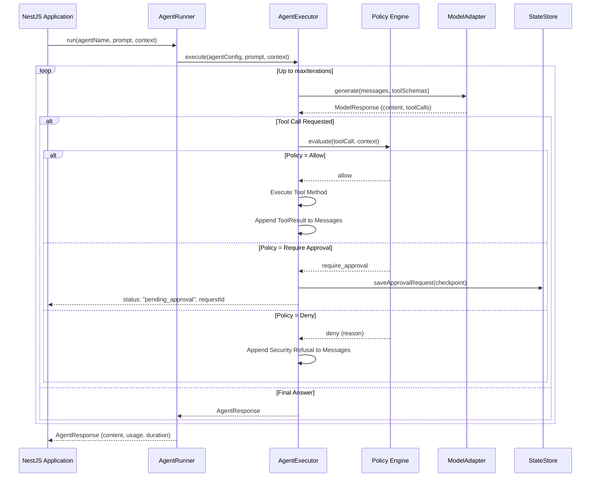

## What is @nestjs-agentic/core?

`@nestjs-agentic/core` is the foundational kernel of the agentic ecosystem. It provides the core runtime abstractions, lifecycle hooks, tool resolution mechanisms, policy enforcement engines, and state store drivers necessary to run autonomous agents in enterprise environments.

---

## Key Responsibilities

- **Declarative Metadata Engine**: Extracts parameter schemas, tool definitions, and agent configurations at module compilation time.
- **Dynamic Tool Execution Pipeline**: Validates incoming model arguments against JSON Schemas and executes tools within guarded NestJS service contexts.
- **Tri-State Governance**: Intercepts tool calls before invocation to enforce deterministic policy boundaries (`allow`, `deny`, `require_approval`).
- **Resumable State Machine**: Persists suspended agent executions (Human-in-the-Loop) to durable state stores without blocking the event loop.
- **Execution Defense & Limits**: Enforces hard token limits (`maxTotalTokens`), iteration bounds (`maxIterations`), and execution timeouts.
- **OpenTelemetry Observability**: Spans model interactions, tool resolutions, and policy decisions for enterprise tracing.

---

## Architectural Lifecycle

When `AgentRunner.run()` is called, the core runtime executes the following sequence:

