## OpenTelemetry Tracing

`@nestjs-agentic/core` integrates natively with the OpenTelemetry SDK.

Every agent invocation automatically creates parent and child spans:

- `agentic.run`: Root execution span.
- `agentic.model.generate`: Individual LLM turn call with token metrics.
- `agentic.tool.execute`: Individual tool execution with timing and arguments.
- `agentic.policy.evaluate`: Security policy decision and latency.

```mermaid
gantt
    title Agentic OpenTelemetry Trace Timeline
    dateFormat X
    axisFormat %s
    section Root
    agentic.run (PR Reviewer) : 0, 18000
    section Ingress & AST RAG
    ingress.auth : 0, 680
    rag.ast_chunking : 680, 4500
    rag.vector_query : 4500, 5100
    section Model & Tools
    model.turn_1 (Security & Arch) : 5100, 14000
    tool.fetch_diff : 14000, 14800
    model.turn_2 (Synthesis) : 14800, 17800
    section Consensus
    consensus.fleiss_kappa : 17800, 18000
```



---

## The ExecutionTracer

For internal logging and markdown accordion telemetry (as seen in the Njent PR reviewer), use `ExecutionTracer`:

```typescript
import { ExecutionTracer } from 'nestjs-agentic';

const tracer = new ExecutionTracer();

tracer.record('ingress', 'Verified HMAC signature & collaborator authorization', 12);
tracer.record('rag', 'Indexed 6 files into AST HybridVectorStore', 3800);
tracer.record('multi_agent', 'Concurrently ran 3 specialist reviewers', 12700);

// Export as markdown log block
const logMarkdown = tracer.toMarkdownAccordion();
```

---

## Tamper-Evident Audit Trail

`HashChainAuditSink` wraps an audit destination and binds each event to its predecessor, so altering or deleting a stored entry becomes detectable:

```typescript
import { HashChainAuditSink, PostgresAuditSink, verifyAuditChain } from '@nestjs-agentic/core';

const store = new PostgresAuditSink({ client: pool });
// Resume the existing chain so restarts don't start a new one.
const sink = new HashChainAuditSink(store, await store.head());

// Later, verify what was persisted:
const report = verifyAuditChain(await store.readChain());
if (!report.valid) {
  console.error(`audit chain broken at entry ${report.brokenAt}: ${report.reason}`);
}
```

`verifyAuditChain` detects a modified event body, a rewritten hash, a re-linked `previousHash`, and a deleted or reordered entry (via the sequence gap). Events are canonically serialized (sorted keys, ISO dates) so identical content always hashes identically, and concurrent `record()` calls are serialized internally, since a chain linked out of order would not verify.

`PostgresAuditSink` works standalone as an `AuditSink` or as the durable destination for a chain. Row identity is database-generated and independent of chain position, so both write modes can share one table; `chain_sequence` is `UNIQUE`, so a competing writer that computes an already-used position fails loudly rather than silently forking the chain.

It only ever inserts. Enforce that at the database level by granting the application role `INSERT`/`SELECT` but not `UPDATE`/`DELETE`, so a compromised application cannot rewrite history even though the chain would reveal it. Those grants exclude `CREATE`, so pair them with `autoCreateTable: false` and create the table from a migration run by a privileged role:

```sql
CREATE TABLE agentic_audit_events (
  id             BIGSERIAL PRIMARY KEY,
  chain_sequence BIGINT UNIQUE,
  type           VARCHAR(64)  NOT NULL,
  session_id     VARCHAR(255) NOT NULL,
  trace_id       VARCHAR(255) NOT NULL,
  tenant_id      VARCHAR(255),
  at             TIMESTAMPTZ  NOT NULL,
  event          JSONB        NOT NULL,
  previous_hash  CHAR(64),
  hash           CHAR(64)
);
CREATE INDEX idx_agentic_audit_events_session ON agentic_audit_events (session_id);
CREATE INDEX idx_agentic_audit_events_tenant  ON agentic_audit_events (tenant_id) WHERE tenant_id IS NOT NULL;
```

A linear chain assumes a **single writer** per chain: `HashChainAuditSink` serializes only within one instance, so in a horizontally-scaled deployment either keep one writer or coordinate sequence allocation in the database. `readChain()` is an operator-level verification primitive that returns every tenant's entries — verify with it from an admin path, don't expose it directly to tenant-facing callers.

This makes tampering **evident**, not impossible: an attacker who can rewrite the entire chain can still produce a self-consistent history. Periodically publishing the latest `headHash()` outside the same trust domain (anchoring) is what closes that gap.
