## OpenTelemetry Tracing

`@nestjs-agentic/core` integrates natively with the OpenTelemetry SDK.

Every agent invocation automatically creates parent and child spans:

- `agentic.run`: Root execution span.
- `agentic.model.generate`: Individual LLM turn call with token metrics.
- `agentic.tool.execute`: Individual tool execution with timing and arguments.
- `agentic.policy.evaluate`: Security policy decision and latency.

```mermaid
gantt
    title Agentic OpenTelemetry Trace Timeline
    dateFormat X
    axisFormat %s
    section Root
    agentic.run (PR Reviewer) : 0, 18000
    section Ingress & AST RAG
    ingress.auth : 0, 680
    rag.ast_chunking : 680, 4500
    rag.vector_query : 4500, 5100
    section Model & Tools
    model.turn_1 (Security & Arch) : 5100, 14000
    tool.fetch_diff : 14000, 14800
    model.turn_2 (Synthesis) : 14800, 17800
    section Consensus
    consensus.fleiss_kappa : 17800, 18000
```



---

## The ExecutionTracer

For internal logging and markdown accordion telemetry (as seen in the Njent PR reviewer), use `ExecutionTracer`:

```typescript
import { ExecutionTracer } from 'nestjs-agentic';

const tracer = new ExecutionTracer();

tracer.record('ingress', 'Verified HMAC signature & collaborator authorization', 12);
tracer.record('rag', 'Indexed 6 files into AST HybridVectorStore', 3800);
tracer.record('multi_agent', 'Concurrently ran 3 specialist reviewers', 12700);

// Export as markdown log block
const logMarkdown = tracer.toMarkdownAccordion();
```
