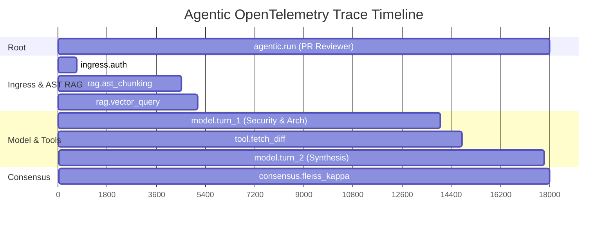

## OpenTelemetry Tracing

`@nestjs-agentic/core` integrates natively with the OpenTelemetry SDK.

Every agent invocation automatically creates parent and child spans:

- `agentic.run`: Root execution span.
- `agentic.model.generate`: Individual LLM turn call with token metrics.
- `agentic.tool.execute`: Individual tool execution with timing and arguments.
- `agentic.policy.evaluate`: Security policy decision and latency.


```mermaid
gantt
    title Agentic OpenTelemetry Trace Timeline
    dateFormat X
    axisFormat %s
    section Root
    agentic.run (PR Reviewer) : 0, 18000
    section Ingress & AST RAG
    ingress.auth : 0, 680
    rag.ast_chunking : 680, 4500
    rag.vector_query : 4500, 5100
    section Model & Tools
    model.turn_1 (Security & Arch) : 5100, 14000
    tool.fetch_diff : 14000, 14800
    model.turn_2 (Synthesis) : 14800, 17800
    section Consensus
    consensus.fleiss_kappa : 17800, 18000
```

---

## What Observers Receive About Errors

Observers usually forward events to external telemetry such as Langfuse, OpenTelemetry collectors, or Datadog. Provider SDK errors routinely carry request configuration, headers, response bodies, and prompt content, so `ObserverNotifier` redacts every error before dispatch. This happens in one place, for every error-carrying event:

| Event | Field |
| --- | --- |
| `onError` | `AgentErrorEvent.error` |
| `onModelRetry` | `ModelRetryEvent.error` |
| `onCircuitStateChange` | `CircuitBreakerEvent.reason` (it embeds the failing call's message) |

With the default `defaultErrorRedactor`, observers receive a `RedactedError` that holds only:

- `name`
- `message`, with credential-shaped values masked (`Bearer` tokens, `sk-` keys, `Authorization`, `Cookie`, `api_key=` and similar pairs, URL credentials, JWTs, GitHub, AWS, Google and Slack tokens, PEM private keys), then capped at 500 characters
- `status` and `statusCode` when numeric, and a short `code` such as `ECONNRESET`
- `stack` frames, under a header line rebuilt from the redacted name and message
- `cause`, redacted the same way, up to 3 links deep

Observers do **not** receive any other property: request config, headers, response bodies, non-enumerable and `Symbol`-keyed fields, and the `errors` of an `AggregateError` are all dropped. The original error is not mutated, and it still propagates to the caller of `run()` unchanged.

Tune the default, supply your own redactor, or opt out:

```typescript
import { AgenticModule, createErrorRedactor } from '@nestjs-agentic/core';

AgenticModule.forRoot({
  defaultModel: { provider: 'openai', model: 'gpt-4o' },
  observability: {
    // Keep longer messages and mask an internal identifier too.
    errorRedaction: createErrorRedactor({ maxMessageLength: 1000, patterns: [/tenant-\d+/g] }),
  },
});

// A local debug observer that never leaves the process can opt out explicitly.
AgenticModule.forRoot({
  defaultModel: { provider: 'openai', model: 'gpt-4o' },
  observability: { errorRedaction: 'none' },
});
```

A custom redactor is any `(error: unknown) => Error`. If it throws, observers receive a placeholder `RedactedError('[error redaction failed]')`, never the raw error.

This redaction covers errors only. `onToolCall` receives the validated tool arguments, and `onToolResult` receives the result exactly as the model sees it, after output policies have run. To keep secrets or PII out of those, use output policies such as `SecretRedactionPolicy` and `PiiRedactionPolicy`.

---

## The ExecutionTracer

For internal logging and markdown accordion telemetry (as seen in the Njent PR reviewer), use `ExecutionTracer`:

```typescript
import { ExecutionTracer } from 'nestjs-agentic';

const tracer = new ExecutionTracer();

tracer.record('ingress', 'Verified HMAC signature & collaborator authorization', 12);
tracer.record('rag', 'Indexed 6 files into AST HybridVectorStore', 3800);
tracer.record('multi_agent', 'Concurrently ran 3 specialist reviewers', 12700);

// Export as markdown log block
const logMarkdown = tracer.toMarkdownAccordion();
```

---

## Tamper-Evident Audit Trail

`HashChainAuditSink` wraps an audit destination and binds each event to its predecessor, so altering or deleting a stored entry becomes detectable:

```typescript
import { HashChainAuditSink, PostgresAuditSink, verifyAuditChain } from '@nestjs-agentic/core';

const store = new PostgresAuditSink({ client: pool });
// Resume the existing chain so restarts don't start a new one.
const sink = new HashChainAuditSink(store, await store.head());

// Later, verify what was persisted:
const report = verifyAuditChain(await store.readChain());
if (!report.valid) {
  console.error(`audit chain broken at entry ${report.brokenAt}: ${report.reason}`);
}
```

`verifyAuditChain` detects a modified event body, a rewritten hash, a re-linked `previousHash`, and a deleted or reordered entry (via the sequence gap). Events are canonically serialized (sorted keys, ISO dates) so identical content always hashes identically, and concurrent `record()` calls are serialized internally, since a chain linked out of order would not verify.

`PostgresAuditSink` works standalone as an `AuditSink` or as the durable destination for a chain. Row identity is database-generated and independent of chain position, so both write modes can share one table.

It only ever inserts. Enforce that at the database level by granting the application role `INSERT`/`SELECT` but not `UPDATE`/`DELETE`, so a compromised application cannot rewrite history even though the chain would reveal it. Those grants exclude `CREATE`, so pair them with `autoCreateTable: false` and create the table from a migration run by a privileged role:

```sql
CREATE TABLE agentic_audit_events (
  id             BIGSERIAL PRIMARY KEY,
  chain_sequence BIGINT UNIQUE,
  type           VARCHAR(64)  NOT NULL,
  session_id     VARCHAR(255) NOT NULL,
  trace_id       VARCHAR(255) NOT NULL,
  tenant_id      VARCHAR(255),
  at             TIMESTAMPTZ  NOT NULL,
  event          JSONB        NOT NULL,
  previous_hash  CHAR(64),
  hash           CHAR(64)
);
CREATE INDEX idx_agentic_audit_events_session ON agentic_audit_events (session_id);
CREATE INDEX idx_agentic_audit_events_tenant  ON agentic_audit_events (tenant_id) WHERE tenant_id IS NOT NULL;
```

### One append authority per chain

A chain requires a **single append authority**. `HashChainAuditSink` serializes `record()` calls within one instance, but it computes `chain_sequence` and `previousHash` from its own in-memory head — so two instances that resumed from the same stored head will both extend it.

The `UNIQUE` constraint on `chain_sequence` only catches the case where both writers pick the *same* position; the second insert then fails loudly. It does **not** catch divergence: if the writers pick different positions, both rows insert successfully and the break only surfaces later, when `verifyAuditChain` reports a predecessor mismatch.

So in a horizontally-scaled deployment, either:

- keep exactly one writer per chain (a leader, a single worker, or a dedicated audit service), or
- allocate positions in the database — take a transaction that locks the current head row, then assign `chain_sequence` and `previousHash` from it within that same transaction.

`readChain()` is an operator-level verification primitive that returns every tenant's entries — verify with it from an admin path, don't expose it directly to tenant-facing callers.

This makes tampering **evident**, not impossible: an attacker who can rewrite the entire chain can still produce a self-consistent history. Periodically publishing the latest `headHash()` outside the same trust domain (anchoring) is what closes that gap.
