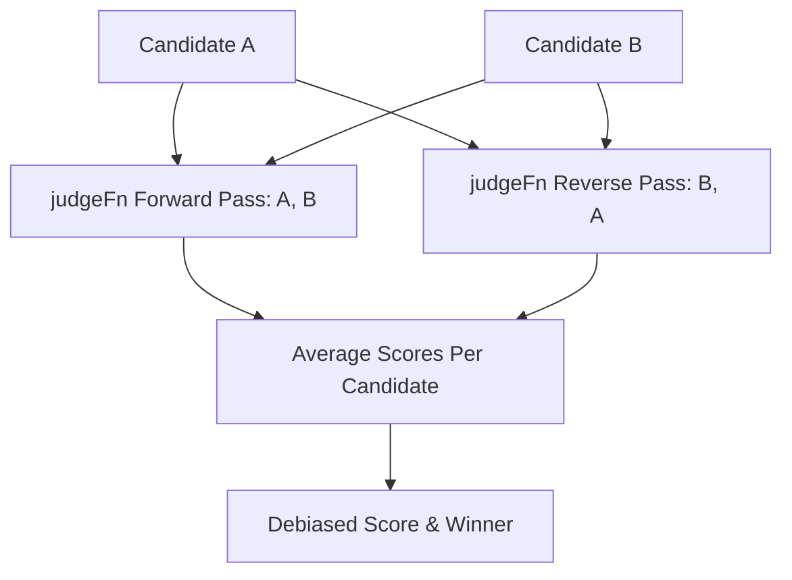

## Position Bias in LLM Judges

LLMs tend to favor whichever candidate answer is placed first.

`PairwiseDebiasedJudge` wraps a `judgeFn` you supply (the actual LLM call) and runs it twice concurrently with swapped positions (forward: `[A, B]`, reverse: `[B, A]`), then averages each candidate's score across both passes:



```typescript
import { PairwiseDebiasedJudge } from '@nestjs-agentic/evaluation';

const judge = new PairwiseDebiasedJudge({
  judgeFn: async (query, first, second, criteria) => {
    // Call your LLM here; `first`/`second` are presented in this order in the prompt.
    return { winner: 'first', scoreFirst: 0.8, scoreSecond: 0.6, reasoning: '...' };
  },
  tieThreshold: 0.05,
});

const result = await judge.evaluate({
  query: 'Summarize pull request security risks',
  candidateA: { id: 'v1', output: outputModelV1 },
  candidateB: { id: 'v2', output: outputModelV2 },
  criteria: 'Security depth, actionable remediation, no false positives',
});

console.log(result.winner); // 'candidate_a' | 'candidate_b' | 'tie'
console.log(result.positionBiasDetected, result.confidence, result.reasoning);
```
