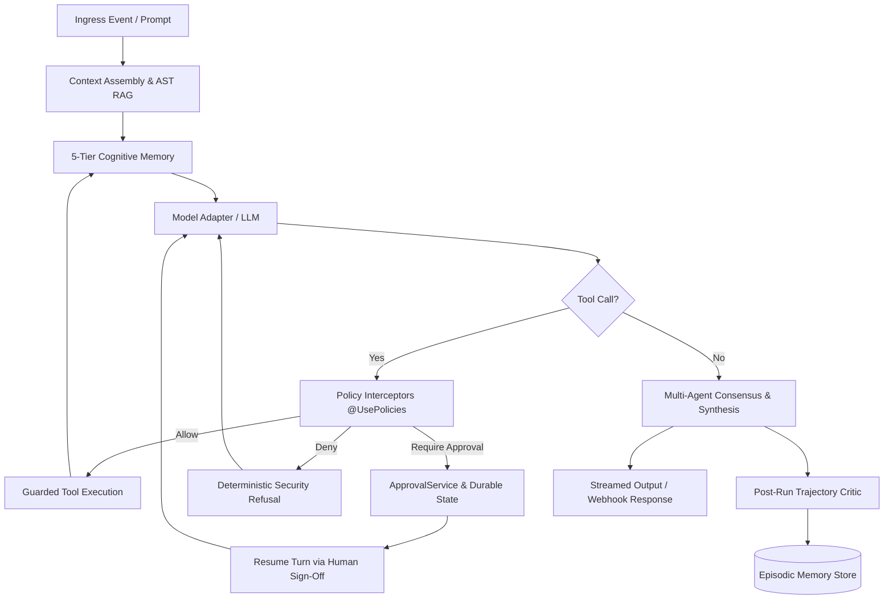

## Overview and Philosophy

`nestjs-agentic` is a production-grade runtime ecosystem for building, governing, and orchestrating autonomous AI agents natively within the NestJS framework.

Traditional LLM integrations treat models as simple stateless request-response endpoints. In contrast, an **Enterprise Agentic System** requires a continuous cognitive lifecycle:

1. **Perception and Ingress**: Ingesting webhooks, user prompts, or system events with strict cryptographic verification and role-based access control.
2. **Context Engineering**: Dynamically assembling relevant symbols, memories, and codebase syntax trees (AST RAG) within bounded token budgets.
3. **Reasoning and Decision Loops**: Iterative turn-taking where the model invokes tools, inspects outputs, and refines internal scratchpad states.
4. **Deterministic Governance**: Intercepting model intents before execution using policy boundaries (`allow`, `deny`, `require_approval`) and durable Human-in-the-Loop (HITL) state machines.
5. **Multi-Agent Collective Intelligence**: Delegating specialized sub-tasks across parallel agents, conducting dialectic multi-agent debates, and computing consensus via inter-rater reliability metrics (Fleiss' Kappa).
6. **Episodic Reflection**: Automatically critiquing execution trajectories post-run to distill persistent lessons and prevent recurring failures.
7. **Rigorous Quality Gates**: Running debiased LLM-as-a-Judge evaluations and trajectory efficiency benchmarks in automated CI/CD pipelines.

---

## Architectural Taxonomy

The runtime ecosystem is decomposed into eight decoupled, modular packages:

| Package | Responsibility | Primary Primitives |
| :--- | :--- | :--- |
| **`@nestjs-agentic/core`** | Agent definition, dependency injection, runtime execution loop, policy governance, state stores, and OpenTelemetry tracing. | `@Agent`, `@ToolSet`, `@Tool`, `@Param`, `@Context`, `@UsePolicies`, `AgenticModule`, `ApprovalService`, `ExecutionLimits` |
| **`@nestjs-agentic/openai`** | Model adapter for OpenAI and compatible Chat Completions endpoints (Ollama, vLLM, Groq, OpenRouter, Azure). | `OpenAiModelAdapter`, `ModelAdapter`, `ModelResponseChunk` |
| **`@nestjs-agentic/memory`** | 5-tier cognitive memory architecture with Stanford tri-factor retrieval scoring. | `ShortTermMemory`, `ScratchpadMemory`, `SemanticMemory`, `EpisodicMemory`, `CompositeMemoryStore` |
| **`@nestjs-agentic/rag`** | Context engineering engine with AST hierarchical chunking, hybrid BM25 + vector search, GraphRAG, and cross-encoders. | `KnowledgeBase`, `HybridVectorStore`, `AstCodeChunker`, `GraphRAGStrategy`, `CrossEncoderReranker` |
| **`@nestjs-agentic/orchestration`** | Multi-agent delegation, parallel fan-out runners, supervisor refinement loops, and multi-agent debate consensus. | `ParallelSubAgentRunner`, `RefinementLoopRunner`, `DebateRoundRunner`, `ConsensusEngine` |
| **`@nestjs-agentic/experience`** | Trajectory reflection engine for automatic lesson extraction and dynamic ingress prompt guidance. | `TrajectoryCriticAgent`, `LessonExtractor`, `IngressGuidanceService` |
| **`@nestjs-agentic/evaluation`** | Benchmarking suite with position-debiased pairwise LLM judges and CI/CD quality regression gates. | `DebiasedPairwiseJudge`, `BenchmarkRunner`, `TrajectoryScorer` |
| **`@nestjs-agentic/mcp`** | Model Context Protocol integration providing standardized client transports and dynamic tool providers. | `McpClientTransport`, `McpToolProvider`, `StdioTransport`, `SseTransport` |
| **`nestjs-agentic`** | Umbrella meta-package providing streamlined exports and zero-configuration developer ergonomics. | Re-exports all core primitives |

---

## The NestJS Agentic Mental Model

Unlike raw scripting frameworks, `nestjs-agentic` is built from the ground up to respect NestJS design principles:

- **Full Dependency Injection**: Agent providers and ToolSet classes are standard NestJS `@Injectable()` services. They inject database repositories, external HTTP clients, cache managers, and microservice clients without architectural friction.
- **Declarative Metadata**: Methods and parameters are decorated with `@Tool()` and `@Param()`, automatically generating valid JSON Schema definitions for LLM tool-calling interfaces.
- **Context Isolation**: Every turn execution receives an isolated `AgentContext` carrying security credentials (`userId`, `tenantId`, `roles`, `permissions`) and execution limits, preventing cross-tenant data leakage.
- **Durable Lifecycle Checkpoints**: Long-running or sensitive actions suspend their execution state in durable stores (PostgreSQL or Redis), waiting for human sign-off without holding Node.js event-loop threads open.
