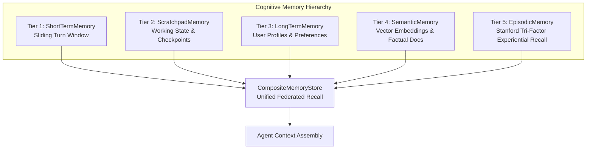

## Overview

Human intelligence relies on distinct memory systems: immediate working memory, structured scratchpads, long-term factual associations, and experiential episodic recall.

`@nestjs-agentic/memory` brings this **5-Tier Cognitive Memory Taxonomy** natively into NestJS:

---

## 5-Tier Memory Taxonomy

| Tier | Memory Store | Persistence | Purpose | Retrieval Method |
| :--- | :--- | :--- | :--- | :--- |
| **Tier 1** | `ShortTermMemory` | Session (In-Memory / Redis) | Immediate multi-turn dialogue history | FIFO / Sliding Window |
| **Tier 2** | `ScratchpadMemory` | In-Flight Turn | Temporary reasoning notes, sub-goals, and checklists | Key-Value Lookups |
| **Tier 3** | `LongTermMemory` | Durable (Postgres / Redis) | User profiles, persistent facts, tenant constraints | Entity-Attribute Query |
| **Tier 4** | `SemanticMemory` | Vector Database (PgVector / Qdrant) | Factual domain documentation and guidelines | Cosine Similarity |
| **Tier 5** | `EpisodicMemory` | Durable Graph / Vector | Past trajectory successes, failure critiques, lessons | Stanford Tri-Factor Scoring |
