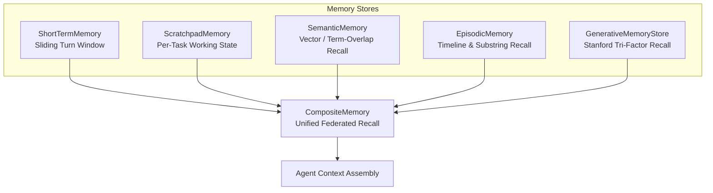

## Overview

Human intelligence relies on distinct memory systems: immediate working memory, structured scratchpads, long-term factual associations, and experiential episodic recall.

`@nestjs-agentic/memory` brings this **5-Tier Cognitive Memory Taxonomy** natively into NestJS:

---

## Memory Store Taxonomy

| Store | Persistence | Purpose | Retrieval Method |
| :--- | :--- | :--- | :--- |
| `ShortTermMemory` | Optional `StateStore` (in-memory or Redis) | Immediate multi-turn dialogue history | FIFO / Sliding Window |
| `ScratchpadMemory` | In-process, per session/task | Temporary reasoning notes, sub-goals, and checklists | Task-keyed lookup |
| `SemanticMemory` | Pluggable `SemanticStoreProvider` (in-memory by default; `HybridVectorStore` for real vectors) | Factual domain documentation and guidelines | Cosine similarity or term overlap |
| `EpisodicMemory` | In-process, per session | Past interaction episodes for substring/timeline recall | Substring filter, `getTimeline()` |
| `GenerativeMemoryStore` | In-process, optional `embedFn` | Full Stanford Tri-Factor experiential recall (recency, importance, relevance) | `StanfordMemoryScorer.rankCandidates` |
| `ProceduralMemoryStore` | In-process | SOP-style playbooks matched to a task/trigger | Tiered trigger/name/description match |
| `CompositeMemory` | Fans out across any of the above | Unified recall across multiple stores | Union, deduplicated by record id |

Every store implements the shared `AgentMemoryStore` interface: `save(record)` and `recall(query, options?)`, with an optional `clear(sessionId?)`. `EpisodicMemory` provides Stanford Tri-Factor-style recency/importance/relevance scoring through `GenerativeMemoryStore` specifically — plain `EpisodicMemory` does substring matching, not scored ranking.
