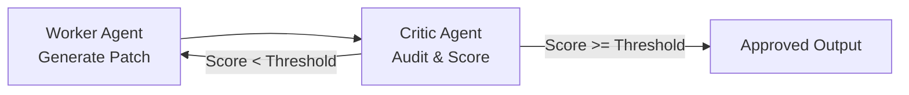

## RefinementLoopRunner

`RefinementLoopRunner` pairs a **Worker Agent** (generating drafts/code) with a **Critic Agent** (evaluating against rules):



```typescript
import { RefinementLoopRunner } from '@nestjs-agentic/orchestration';

const refinementLoop = new RefinementLoopRunner({
  worker: codeGeneratorAgent,
  critic: linterCriticAgent,
  maxIterations: 3,
  targetScore: 0.90,
  budget: {
    maxTotalTokens: 25000,
    maxTotalTimeMs: 45000,
  },
});

const refinedCode = await refinementLoop.run({
  prompt: 'Generate user registration service with bcrypt password hashing',
});
```
