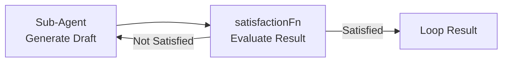

## RefinementLoopRunner

`RefinementLoopRunner` re-runs a single sub-agent across iterations, feeding it either a custom `feedbackProviderFn` or evaluating each iteration's result against a `satisfactionFn`, stopping when satisfied, `maxIterations` is reached, or the configured token/duration budget is exhausted:



```typescript
import { RefinementLoopRunner } from '@nestjs-agentic/orchestration';

const refinementLoop = new RefinementLoopRunner(agentRunner, {
  maxIterations: 3,
  qualityThreshold: 0.9,
  satisfactionFn: (result) => ({ satisfied: (result.score ?? 0) >= 0.9, feedback: result.error }),
  budget: {
    maxTotalTokens: 25000,
    maxTotalTimeMs: 45000,
  },
  stateStore: myStateStore, // optional, enables checkpointed resumption
});

const outcome = await refinementLoop.run(parentContext, {
  agentName: 'codeGeneratorAgent',
  message: 'Generate user registration service with bcrypt password hashing',
});
```

`RefinementLoopRunner.resume(parentContext, checkpoint, feedbackProviderFn?)` resumes an interrupted loop directly from a saved `RefinementLoopCheckpoint` when a `stateStore` was configured.
