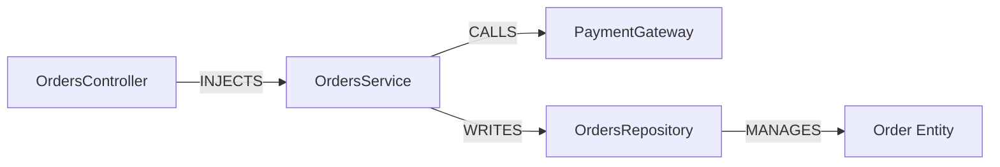

## Overview

Complex software systems have dense relational topologies (e.g. `Controller -> Service -> Repository -> Entity`). Vector search alone cannot traverse multi-hop foreign relationships.

`GraphRAGStrategy` extracts entities and directed relations (`CALLS`, `INJECTS`, `MANAGES`, `EXTENDS`) into an in-memory or graph database (Neo4j / Memgraph).



---

## Usage

```typescript
import { GraphRAGStrategy, KnowledgeGraph } from '@nestjs-agentic/rag';

const graph = new KnowledgeGraph();

// Add relational facts
graph.addRelation('OrdersService', 'INJECTS', 'PaymentGateway');
graph.addRelation('PaymentGateway', 'REQUIRES_ENV', 'STRIPE_SECRET_KEY');

const graphStrategy = new GraphRAGStrategy({ graph, maxHops: 2 });

// Multi-hop relational retrieval
const relationalContext = await graphStrategy.queryRelated('OrdersService');
// Returns connected nodes: PaymentGateway, STRIPE_SECRET_KEY
```
