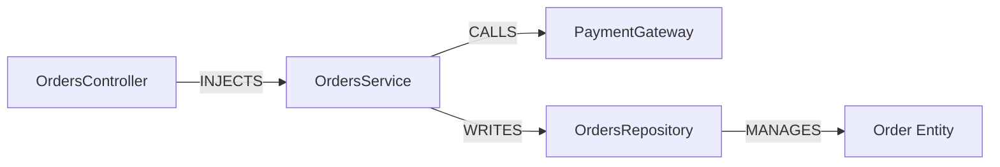

## Overview

Complex software systems have dense relational topologies (e.g. `Controller -> Service -> Repository -> Entity`). Vector search alone cannot traverse multi-hop foreign relationships.

`GraphRAGStrategy` traverses a `KnowledgeGraphProvider` — a graph of entities and directed relations (`CALLS`, `INJECTS`, `MANAGES`, `EXTENDS`) that you populate, either manually or from your own extraction pipeline. `InMemoryKnowledgeGraphProvider` ships as the built-in in-memory implementation; a database-backed provider (Neo4j, Memgraph) can be supplied by implementing the same interface.



---

## Usage

```typescript
import { GraphRAGStrategy, InMemoryKnowledgeGraphProvider } from '@nestjs-agentic/rag';

const graph = new InMemoryKnowledgeGraphProvider();

// Add nodes and directed relational edges
await graph.addNode({ id: 'OrdersService', label: 'OrdersService' });
await graph.addNode({ id: 'PaymentGateway', label: 'PaymentGateway' });
await graph.addEdge({ sourceId: 'OrdersService', targetId: 'PaymentGateway', relation: 'INJECTS' });

const graphStrategy = new GraphRAGStrategy({ graphProvider: graph, maxDepth: 2 });

// Used as a post-retrieval RAGPipeline stage; it boosts chunk scores for
// entities matched in the query and attaches graph facts to the RAGContext.
// For direct traversal, query the provider itself:
const subGraph = await graph.querySubGraph('OrdersService', 2);
// { nodes: [...], edges: [...] } reachable within 2 hops
```

There is no automatic entity/relationship extraction pipeline that builds this graph from source code today — populating it is the caller's responsibility.
