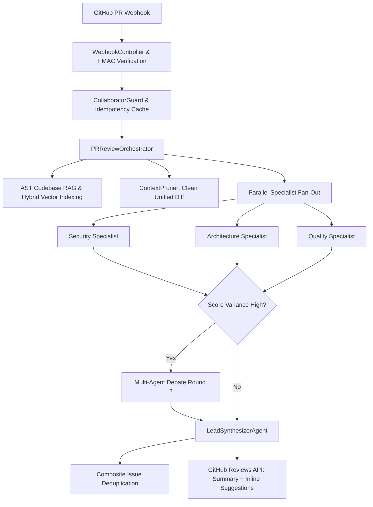

## Overview

**Njent** is the flagship showcase agent built on `nestjs-agentic`. It autonomously ingests GitHub pull request webhooks, parses repository syntax trees with AST RAG, fans out to specialist review agents, conducts multi-agent debates, and submits rich, line-anchored review comments via the GitHub API.

