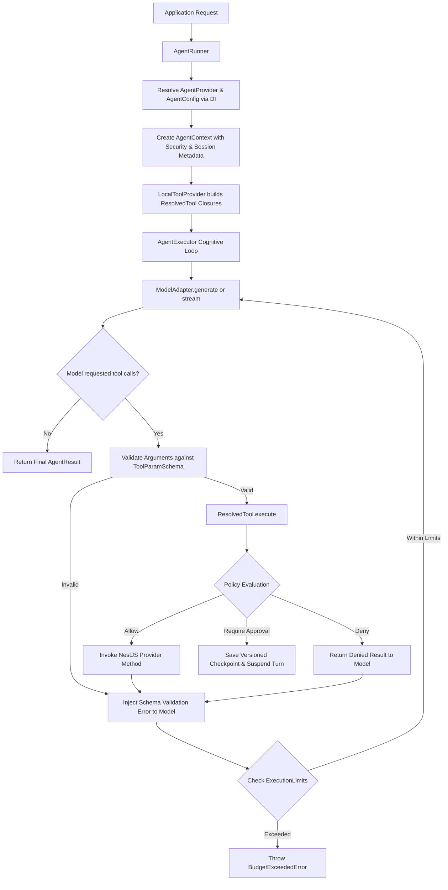
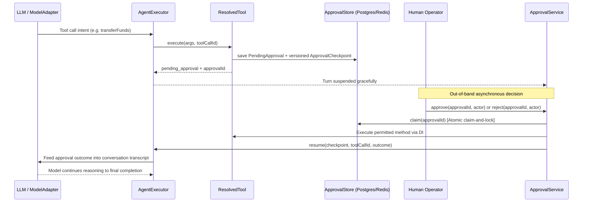

# Architecture Guide

This document describes the production architecture of **nestjs-agentic** (v1.0.0 GA), the security boundaries that govern tool executions, durable state persistence, and the decoupled multi-package ecosystem.

---

## 🏛️ Architectural Position

`nestjs-agentic` is an enterprise runtime and governance layer for building autonomous, governed AI agents natively in NestJS.

Unlike external scripting libraries or rigid graph frameworks, `nestjs-agentic` operates entirely inside the NestJS Dependency Injection (DI) and lifecycle container:
1. **NestJS-Native Providers**: Agents and ToolSets are standard `@Injectable()` services that inject database repositories, HTTP clients, caches, and microservice clients.
2. **Context-Bound Tool Closures**: Tools never execute raw or unverified. Application security context (`tenantId`, `userId`, `roles`, `permissions`) is bound directly to tool execution closures.
3. **Policy-Gated Execution**: Policies (`allow`, `deny`, `require_approval`) intercept every model intent before side effects occur.
4. **Vendor-Neutral Decoupling**: Models and external transports are pluggable adapters (`ModelAdapter`, `McpClientTransport`). Core execution logic remains independent of proprietary SDKs.

---

## 📦 Package Ecosystem & Boundaries

The ecosystem is decomposed into seven modular runtime packages plus one umbrella meta-package:

```text
Application Services & Modules
    │
    ▼
nestjs-agentic (Meta Package)
    │
    ├── @nestjs-agentic/core
    │     Agents, Tools, Policies, HITL Approvals, Checkpoints, Limits, Tracing
    │
    ├── @nestjs-agentic/openai
    │     ModelAdapter for OpenAI, Azure, Ollama, Groq, vLLM, OpenRouter
    │
    ├── @nestjs-agentic/memory
    │     ShortTerm, Working Scratchpad, Semantic Vector, Episodic Tri-Factor
    │
    ├── @nestjs-agentic/rag
    │     AST-Aligned Code Chunking, HybridVectorStore, GraphRAG, Pluggable Reranking
    │
    ├── @nestjs-agentic/orchestration
    │     Parallel Fan-Out (Bounded Concurrency), Refinement Loops, Debate Consensus
    │
    ├── @nestjs-agentic/evaluation
    │     Debiased Pairwise Judge, BenchmarkRunner, Trajectory Inspection
    │
    └── @nestjs-agentic/mcp
          Model Context Protocol (Stdio / SSE Client Transports, Tool Discovery)
```

| Package | Responsibility | Primary Primitives |
| :--- | :--- | :--- |
| **`@nestjs-agentic/core`** | Agent lifecycle, DI discovery, tool policy governance, execution limits, state stores, and OpenTelemetry tracing. | `@Agent`, `@ToolSet`, `@Tool`, `@Param`, `@Context`, `@UsePolicies`, `AgenticModule`, `ApprovalService`, `ExecutionLimits` |
| **`@nestjs-agentic/openai`** | Model adapter for OpenAI and compatible Chat Completions endpoints with streaming and token tracking. | `OpenAiModelAdapter`, `ModelAdapter`, `ModelResponseChunk` |
| **`@nestjs-agentic/memory`** | 5-tier cognitive memory architecture with Stanford tri-factor retrieval scoring. | `ShortTermMemory`, `ScratchpadMemory`, `SemanticMemory`, `EpisodicMemory`, `CompositeMemory` |
| **`@nestjs-agentic/rag`** | Context engineering engine with AST-aligned code chunking, hybrid vector + lexical search, GraphRAG, and pluggable reranking. | `KnowledgeBase`, `HybridVectorStore`, `AstCodebaseSplitter`, `GraphRAGStrategy`, `RerankerStrategy` |
| **`@nestjs-agentic/orchestration`** | Multi-agent delegation, parallel fan-out runners, supervisor refinement loops, and multi-agent debate consensus. | `ParallelSubAgentRunner`, `RefinementLoopRunner`, `DebateRunner`, `SubAgentDelegator` |
| **`@nestjs-agentic/evaluation`** | Benchmarking suite with position-debiased pairwise LLM judges and CI/CD quality regression gates. | `PairwiseDebiasedJudge`, `BenchmarkRunner`, `TrajectoryInspectorMetric` |
| **`@nestjs-agentic/mcp`** | Model Context Protocol integration providing standardized client transports and dynamic tool providers. | `McpClientTransport`, `McpToolProvider`, `StdioTransport`, `SseTransport` |
| **`nestjs-agentic`** | Umbrella meta-package providing streamlined exports and zero-configuration developer ergonomics. | Re-exports all core primitives |

---

## ⚡ Execution Lifecycle & Cognitive Loop



---

## 🛡️ Governed Tool Boundary (`ResolvedTool`)

A `ResolvedTool` is the core security boundary between model-driven actions and application side effects.

```text
ResolvedTool.execute({ args, toolCallId })
    │
    ├── 1. Evaluate Attached Policies (@UsePolicies)
    │     ├── Evaluate with AgentContext, tool name, arguments, and metadata
    │     │
    │     ├── DENY ──► Return { success: false, status: 'denied', reason }
    │     │
    │     └── REQUIRE_APPROVAL ──►
    │           Save serializable PendingApproval with versioned ApprovalCheckpoint
    │           Return { success: false, status: 'pending_approval', approvalId, reason }
    │
    └── 2. ALLOW (Permitted Execution)
          Map validated parameters to method signature
          Inject AgentContext into parameter decorated with @Context()
          Execute NestJS provider method inside application DI scope
          Sanitize output via Tri-Rail guardrails
          Return { success: true, data }
```

### Key Security Invariants:
1. **No Raw References**: Models and external runtimes never receive raw references to NestJS provider instances or database connections.
2. **Deterministic Context**: Application context (`tenantId`, `userId`, `roles`) is injected by the framework and cannot be spoofed or overridden by the LLM.
3. **Idempotency Safeguards**: Sensitive side effects utilize `IdempotencyPolicy` backed by `RedisIdempotencyStore` or `PostgresIdempotencyStore` to prevent duplicate operations during retries.

---

## 👥 Human-in-the-Loop (HITL) & Durable Turn Resumption



### Checkpoint & Resumption Invariants:
* **Atomic Claim-and-Lock**: `ApprovalStore.claim()` atomically claims pending approvals before execution, guaranteeing at-most-once settlement even under concurrent webhook retries.
* **Process-Agnostic Resumption**: The `ApprovalCheckpoint` contains the complete serialized transcript, allowing a different worker node in a cluster to resume the turn seamlessly.
* **Audit Trail Integration**: All terminal approval events (approved, rejected, expired, failed) are broadcast to configured `AuditSink` listeners.

---

## 🧠 Cognitive Memory Architecture (`@nestjs-agentic/memory`)

`@nestjs-agentic/memory` provides a 5-tier hierarchical cognitive memory system:

1. **Short-Term Session Memory (`ShortTermMemory`)**: Sliding-window conversation transcripts, backed by an optional `StateStore` (in-memory or Redis).
2. **Working Scratchpad (`ScratchpadMemory`)**: Per-session, per-task working set for interim reasoning notes, keyed by `metadata.taskId`.
3. **Semantic Vector Memory (`SemanticMemory`)**: Recall over a pluggable `SemanticStoreProvider` (defaults to an in-memory term-overlap store; `@nestjs-agentic/rag`'s `HybridVectorStore` can be supplied for real vector search).
4. **Episodic Experiential Memory (`EpisodicMemory`)**: Stores historical execution episodes; the Stanford Tri-Factor scoring formula is implemented separately in `StanfordMemoryScorer` (`@nestjs-agentic/memory`'s `scoring` module) and applied via `GenerativeMemoryStore`:
   $$\text{Score} = (w_{\text{recency}} \cdot S_{\text{recency}}) + (w_{\text{importance}} \cdot S_{\text{importance}}) + (w_{\text{relevance}} \cdot S_{\text{relevance}})$$
5. **Composite Memory Aggregation (`CompositeMemory`)**: Fans out `save()` and unions `recall()` (deduplicated by record id) across multiple `AgentMemoryStore` instances.

All stores implement the shared `AgentMemoryStore` interface (`save(record)` / `recall(query, options?)` / `clear?(sessionId?)`), so any store can be composed or swapped without changing calling code.

---

## 🔍 Context Engineering & GraphRAG (`@nestjs-agentic/rag`)

`@nestjs-agentic/rag` addresses the *Lost in the Middle* phenomenon and contextual fragmentation:

* **AST-Aligned Code Splitting (`AstCodebaseSplitter`)**: Splits source code along regex-matched syntactic boundaries (classes, interfaces, functions, enums) while preserving JSDoc, decorators, and import metadata. Deliberately regex-based rather than a full compiler AST parse, to avoid pulling in a TypeScript-program dependency and to stay immune to catastrophic backtracking.
* **Hybrid Retrieval (`HybridVectorStore`)**: Combines dense cosine-similarity vector search with a real BM25 sparse keyword score (IDF-weighted, `k1`/`b` length-normalization, incremental corpus statistics maintained on `addChunks`/`deleteChunk`), fused via a configurable weighted sum (`vectorWeight`, default `0.5`). Reciprocal Rank Fusion is tracked as forward work — see [issue #130](https://github.com/irzix/nestjs-agentic/issues/130).
* **Relational Traversal (`GraphRAGStrategy` + `InMemoryKnowledgeGraphProvider`)**: Traverses a manually or programmatically populated entity-relationship graph (imports, callers, inheritance) via BFS sub-graph queries, boosting chunks that mention matched entities.
* **Pluggable Reranking (`RerankerStrategy`)**: A post-retrieval hook accepting any custom `rerankFn` (e.g. a Cohere Rerank or cross-encoder call you supply); falls back to term-overlap scoring when no function is provided. Built-in provider adapters are tracked in [issue #132](https://github.com/irzix/nestjs-agentic/issues/132).

---

## 🎭 Multi-Agent Orchestration (`@nestjs-agentic/orchestration`)

`@nestjs-agentic/orchestration` coordinates parallel, distributed, and iterative agent workflows:

* **Parallel Fan-Out (`ParallelSubAgentRunner`)**: Executes multiple specialist agents concurrently with bounded resource limits (`maxConcurrency`), unified `AbortSignal` cancellation propagation, and configurable aggregation strategies (`allSettled`, `firstSuccess`, `fallbackChain`, `bestOf`, `consensusMerge`).
* **Supervisor Refinement Loops (`RefinementLoopRunner`)**: Iterative review-and-correct loops where a supervisor critiques and refines draft outputs until acceptance criteria or iteration limits are met, with distributed-lock-protected, checkpointed resumption via an optional `StateStore`.
* **Multi-Agent Debate (`DebateRunner`)**: Facilitates multi-round cross-critique debates among competing agents. Convergence is measured via a normalized-variance consensus score over each round's confidence scores (not Fleiss' Kappa — that formula is tracked as a possible future consensus metric, not what ships today):
  $$\text{Consensus} = 1 - \frac{\text{Variance}(\text{scores})}{0.25}$$

---

## 📊 Evaluation & Quality Benchmarking (`@nestjs-agentic/evaluation`)

`@nestjs-agentic/evaluation` provides automated quality gates for CI/CD pipelines:

* **Position-Debiased Pairwise Judge (`PairwiseDebiasedJudge`)**: Runs bidirectional pairwise evaluations $(A \text{ vs } B \text{ and } B \text{ vs } A)$ to eliminate position and verbosity bias.
* **Trajectory Inspection (`TrajectoryInspectorMetric`)**, alongside `ExecutionEfficiencyMetric` and `ToolPrecisionMetric`: Evaluate agent decision paths based on token efficiency, tool-calling precision, and step count.
* **Automated Benchmark Runner (`BenchmarkRunner`)**: Executes structured test suites against a registered `AgentRunner` with pass/fail regression thresholds. Retrieval-specific metrics (recall@k, nDCG, faithfulness) are not yet implemented — tracked in [issue #143](https://github.com/irzix/nestjs-agentic/issues/143).

---

## 🔌 Model Context Protocol (`@nestjs-agentic/mcp`)

`@nestjs-agentic/mcp` connects NestJS agents to standardized MCP tool ecosystems:

* **Stdio Client Transport (`StdioTransport`)**: Spawns local CLI-based MCP server subprocesses with bidirectional JSON-RPC 2.0 communication.
* **SSE Client Transport (`SseTransport`)**: Connects to remote HTTP Server-Sent Events (SSE) MCP endpoints with automatic reconnects and heartbeat monitoring.
* **Dynamic Discovery (`McpToolProvider`)**: Automatically queries remote MCP servers for tool schemas and registers them as governed NestJS `ResolvedTool` instances.

---

## 📐 Design Principles

1. **NestJS-Native DI First**: Framework primitives integrate seamlessly with standard NestJS lifecycle hooks (`OnModuleInit`, `OnModuleDestroy`) and dependency injection.
2. **Explicit Governance Over Open Autonomy**: Every tool execution must pass through policy evaluation; models cannot bypass security boundaries.
3. **Deterministic Application Context**: User identities, tenant boundaries, and access roles are managed by application services, never inferred by LLMs.
4. **Zero Vendor Lock-In**: Decoupled contracts allow switching between OpenAI, Anthropic, Gemini, Ollama, and local models with zero application code changes.
5. **Production Durability by Default**: State stores, execution checkpoints, and idempotency guarantees ensure enterprise reliability in multi-instance cluster deployments.
