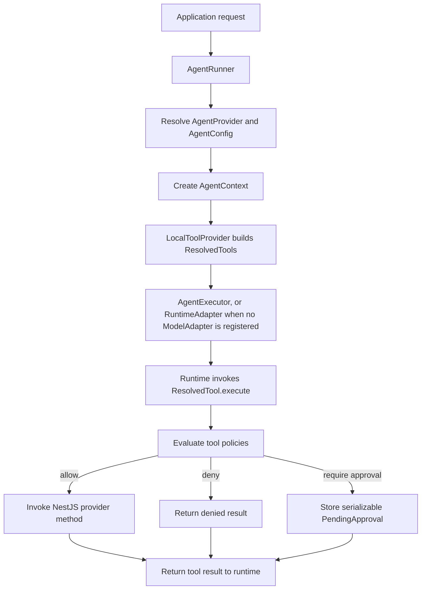
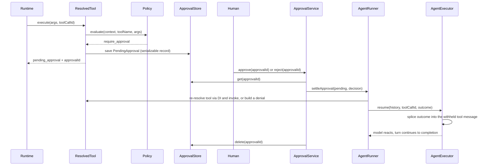
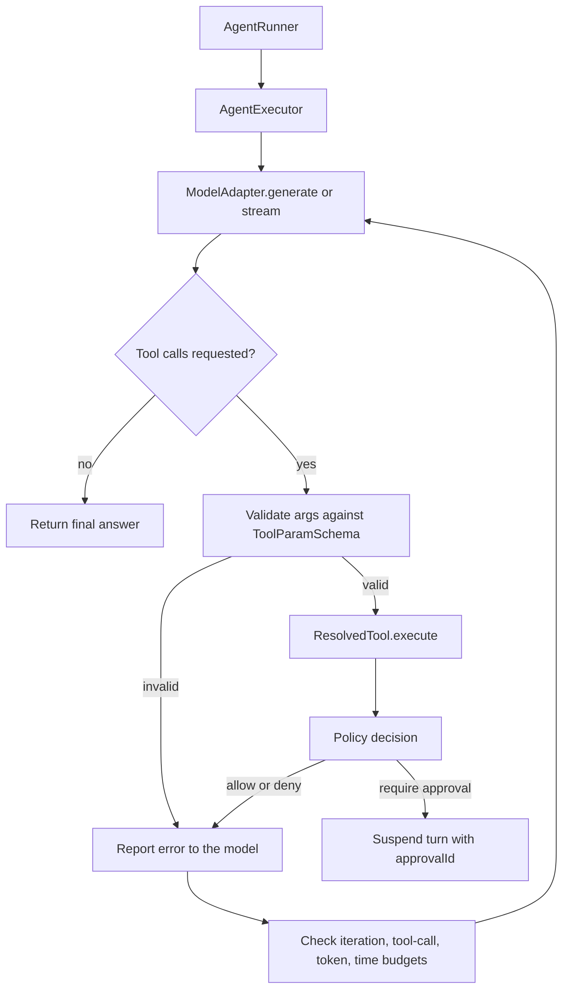
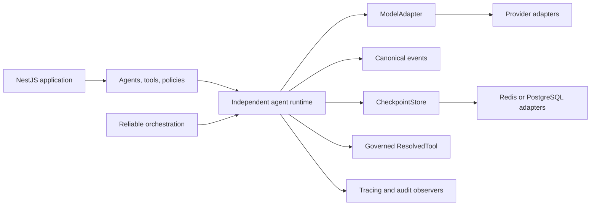

# Architecture Guide

This document describes the current architecture of **nestjs-agentic**, the boundaries that protect tool execution, and the direction of the independent runtime planned in the [product roadmap](ROADMAP.md).

## Architectural Position

nestjs-agentic is a NestJS-native runtime and governance layer for bounded AI agents. Application services remain ordinary NestJS providers. The framework discovers selected methods as tools, binds application-owned context to them, and enforces policies before a runtime can invoke their side effects.

The core package does not require a specific model provider or graph framework.

## Package Boundaries

```text
Application
    |
    +-- @nestjs-agentic/core
    |     agents, tools, policies, approvals, stores, AgentRunner
    |
    +-- model adapter for the built-in runtime
    |     @nestjs-agentic/openai
    |     custom ModelAdapter
    |
    +-- or an external runtime adapter
    |     @nestjs-agentic/adk
    |     @nestjs-agentic/langgraph
    |     custom RuntimeAdapter
    |
    +-- optional capability packages
          memory, experience, rag, orchestration, evaluation
```

| Package area | Responsibility |
| --- | --- |
| `core` | NestJS registration, metadata discovery, agent context, governed tools, the built-in agent runtime, model and runtime contracts, approvals, and store contracts. |
| Runtime adapters | Translate the framework runtime input to a provider or compatibility SDK. Current adapters are experimental and may not provide identical behavior. |
| `memory`, `experience`, `rag` | Opt-in cognitive and retrieval primitives. They are not automatically attached to `AgentRunner`. |
| `orchestration` | Opt-in delegation, parallel execution, fallback, and refinement built on `AgentRunner`. It is not currently a durable graph engine. |
| `evaluation` | Opt-in metrics, benchmark execution, and reporting. |

## Current Execution Path



`AgentRunner` performs the following work for each run:

1. Resolves the registered agent by name.
2. Reads its instructions, tools, and model configuration.
3. Creates an `AgentContext` containing the session, trace, security, and application data.
4. Asks `LocalToolProvider` to convert decorated NestJS methods into `ResolvedTool` closures.
5. Passes the message, tools, instructions, and model configuration to the selected `RuntimeAdapter`.

The runtime never receives raw access to NestJS tool instances or the application security context. It receives callable `ResolvedTool` objects.

## Governed Tool Boundary

A `ResolvedTool` is the main security boundary between model-driven decisions and application side effects:

```text
ResolvedTool.execute({ args })
    |
    +-- resolve configured policies
    +-- evaluate policies with AgentContext, tool name, and arguments
    |
    +-- deny
    |     return { success: false, status: 'denied', reason }
    |
    +-- require_approval
    |     save PendingApproval (serializable: agentName, toolName, args, context, toolCallId)
    |     return { success: false, status: 'pending_approval', approvalId, reason }
    |
    +-- allow
          map arguments to the decorated method
          inject AgentContext into @Context parameter
          invoke the NestJS provider method
          return { success: true, data }
```

This design keeps policy enforcement independent of model and runtime adapters. A compliant adapter invokes the provided closure instead of calling application services directly.

## Human-in-the-Loop: Current Behavior



`PendingApproval` is a plain serializable record — `agentName`, `toolName`, `args`, `context`, and the originating `toolCallId` — rather than a JavaScript closure over live objects. This makes two things possible that were not before:

- **Persistence across restarts and instances.** Because there is no closure to keep alive, `ApprovalStore` implementations like `RedisApprovalStore` can persist a pending approval and resolve it from a different process than the one that created it. Resolving an approval re-resolves the agent, its tool sets, and the target method through Nest DI using `agentName` and `toolName`, rather than reusing a captured reference.
- **Resuming the original model turn.** When a `PendingApproval` carries a `toolCallId` (always true for turns run by the built-in `AgentExecutor`), `AgentRunner.settleApproval()` loads the checkpointed transcript, splices the resolved outcome into the exact tool message that was withheld, and calls `AgentExecutor.resume()`, which continues the model-to-tool loop from there. The model sees the approval or denial as an ordinary tool result and can react to it — answer, request another tool, or suspend again — instead of the conversation simply ending at the suspension point. `ApprovalService.approve()`/`reject()` therefore return the full `AgentResult` for built-in-runtime turns, not the bare `ToolExecutionResult`.

Approvals created outside the built-in runtime (an agent driven entirely by a `RuntimeAdapter`, which has no `toolCallId` to resume against) keep returning the bare `ToolExecutionResult`, matching prior behavior for that path.

**At-most-once settlement.** `ApprovalService.approve()`/`reject()` claim the approval through `ApprovalStore.claim()`, an atomic remove-and-return, before running the withheld tool. Concurrent settlements of the same approval, or a retry after a restart, therefore resolve exactly one caller and reject the rest with `ApprovalNotFoundError` — the side effect runs at most once. The claim happens before execution, so a tool that fails after being claimed is not retried; end-to-end exactly-once for a side effect still depends on the tool itself being idempotent, which is tracked as follow-up idempotency-key work.

**Expiry.** An approval created with a TTL (a policy's `ttlSeconds` or the module's `approvalTtlSeconds`) carries an `expiresAt`. Resolving it past that instant throws `ApprovalExpiredError` instead of acting on stale context, and the claim consumes it so it is not left for a retry. `RedisApprovalStore` derives the key's Redis TTL from `expiresAt` plus a grace window, so abandoned approvals are garbage-collected rather than lingering forever.

**Execution checkpoints.** Suspending no longer depends on `SessionStore` to stay resumable. When a turn suspends, `AgentExecutor` reports the suspension point through an `onSuspend` callback and `AgentRunner` writes it onto the approval as a versioned `ApprovalCheckpoint` — the conversation up to and including the withheld tool message, untrimmed and without system messages, since instructions are re-derived from `AgentConfig` on resume. `settleApproval()` treats that checkpoint as authoritative and only falls back to session history for approvals that predate it. Two properties follow:

- **Ordering.** The checkpoint is written before the suspended turn returns, and the `approvalId` only becomes observable to a caller when it does. There is no window in which an approval can be settled without its checkpoint already durable.
- **Layering.** `AgentExecutor` still performs no persistence of its own; it reports the checkpoint the same way it reports the finished transcript, and `AgentRunner` owns the writes.

A checkpoint whose `version` this release does not recognize is refused with `ApprovalCheckpointVersionError` rather than misread. Checkpoints are deliberately untrimmed, so an approval record is proportionally larger than the trimmed session transcript for the same turn.

**Audit trail.** The policy boundary and the approval lifecycle are recordable. `LocalToolProvider` reports each gating decision, and `ApprovalService` reports every terminal state of an approval — settled, expired, or failed after being claimed — to any registered `AuditSink` through the `AuditTrail` service. Because settling routes through one shared private method, the approving and rejecting paths cannot drift apart in what they record.

Recording who decided required an API change: `approve()`/`reject()` previously took no identity, so "who approved" was unrecordable. They now accept an `actor`, supplied by the application, since the framework never infers identity.

Three defaults are deliberate. Tool arguments are withheld unless `audit.includeArgs` is set, because an audit store usually outlives application logs and arguments can carry secrets. `allow` decisions are omitted unless asked for, because every governed call produces one and that volume is tracing rather than audit. And a sink that throws is isolated — failing an already-approved refund because a log store is unreachable is worse than losing the entry, so sinks that cannot lose events must buffer durably themselves.

What remains roadmap work:

- idempotency keys so a claimed-but-failed tool can be safely retried without risking a duplicate side effect;
- checkpointing turns that are still in flight, rather than only at an approval suspension point (see [State, Sessions, and Memory](#state-sessions-and-memory));
- traces and metrics for model and tool execution, which are part of the observability milestone rather than the governance trail.

Both built-in stores are verified by `runApprovalStoreContract()`, the exported behavioral suite any `ApprovalStore` can run. Because the contract asserts that records behave as serializable data — `Date` fields revived as `Date`s, returned records isolated from stored state, `claim()` atomic under concurrent callers — `InMemoryApprovalStore` stores serialized snapshots rather than live references. A record that would not survive a real store therefore fails in development too, instead of appearing to work until it reaches Redis.

Applications that need durability today should provide a persistent `ApprovalStore`, such as `RedisApprovalStore`. A persistent `SessionStore` is still recommended so the conversation continues across turns, but resuming an approval no longer depends on it.

## Built-in Agent Runtime

When the application registers a `ModelAdapter`, `AgentRunner` executes the turn through the framework-owned `AgentExecutor` instead of handing the whole turn to a runtime adapter:



The executor owns the behavior that every agent framework needs:

- iteration over model rounds until a final answer;
- argument validation, which drops undeclared keys and rejects incomplete calls before an application method runs;
- governed tool invocation through `ResolvedTool.execute()`;
- reporting a thrown tool error back to the model so the turn can recover, while framework configuration errors stay fatal;
- suspension when a policy requires approval;
- bounded execution via `ExecutionLimits` and an `AbortSignal`;
- token and tool lifecycle streaming through the shared `AgentStreamEvent` union.

A `ModelAdapter` only talks to a provider. It does not execute tools, evaluate policies, or manage the loop:

```typescript
interface ModelAdapter {
  generate(request: ModelRequest): Promise<ModelResponse>;
  stream?(request: ModelRequest): AsyncIterable<ModelStreamChunk>;
}
```

`MockModelAdapter` ships with core so agents, policies, and the loop can be tested deterministically without a provider. `@nestjs-agentic/openai` implements the contract for OpenAI and Chat Completions compatible endpoints.

Both are verified by `runModelAdapterContract()`, the exported behavioral suite that any adapter, including a third-party one, can run to prove it satisfies the same guarantees.

## Runtime Adapter Boundary

The original delegation contract remains supported for applications that bring an entire external runtime:

```typescript
interface RuntimeAdapter {
  execute(input: AgentRunInput): Promise<AgentResult>;
  stream?(input: AgentRunInput): AsyncIterable<AgentStreamEvent>;
}
```

`AgentRunner` prefers the built-in runtime when a `ModelAdapter` is registered and otherwise uses the registered `RuntimeAdapter`, so existing applications keep working unchanged. This contract does not standardize model messages, tool-call rounds, usage, cancellation, or provider errors, so adapters written against it can differ in behavior.

- `MockRuntimeAdapter` supports deterministic framework tests.
- `AdkRuntimeAdapter` is an experimental synthetic runtime prototype published under `@nestjs-agentic/adk`; it does not currently integrate with provider-native ADK APIs.
- `LangGraphRuntimeAdapter` supports LangChain model and LangGraph checkpointer types, but does not currently compile or execute a LangGraph `StateGraph`.

The independent runtime milestone will move common model and tool-loop behavior behind framework-owned contracts while keeping provider integrations optional.

## Streaming: Current Behavior

`AgentRunner.runStream()` exposes `AgentStreamEvent` values.

With the built-in runtime, events follow a defined order per round: model tokens, then `tool_start`, then exactly one of `tool_result`, `approval_required`, or `tool_error`, and finally `complete`. Adapters that implement `ModelAdapter.stream()` produce incremental tokens; those that only implement `generate()` emit the round content as a single token event.

When execution is delegated to a `RuntimeAdapter`, event behavior depends on that adapter. If it does not implement `stream()`, the runner converts the completed `AgentResult` into tool and completion events. Failures that end a run, such as an exhausted budget or cancellation, still propagate as thrown errors rather than stream events.

## State, Sessions, and Memory

These concepts exist today but do not yet form one execution lifecycle:

| Concept | Current role |
| --- | --- |
| `SessionStore` | Conversation history for the built-in runtime, keyed by tenant and session, with an in-memory default. |
| `StateStore` | General state abstraction with in-memory and Redis implementations. It can be registered through `AgenticModule`. |
| Runtime checkpointer | Adapter-specific checkpoint facility, currently separate from core stores. |
| Memory packages | Explicitly constructed short-term, semantic, episodic, and scratchpad memory primitives. |

`AgentRunner` persists conversation history through `SessionStore` so turns on the same session continue each other. A turn that suspends for approval carries its own `ApprovalCheckpoint` on the pending approval, so with a persistent `ApprovalStore` it can be resumed from a different process without relying on the session transcript still being intact. What is not yet covered is checkpointing a turn that is still in flight: the loop's iteration count and accumulated usage are only snapshotted at a suspension point, so a process crash mid-round still loses that round. The durable execution milestone covers that remaining gap and audit events.

## Orchestration: Current Behavior

`@nestjs-agentic/orchestration` calls `AgentRunner` to provide:

- sub-agent delegation;
- parallel fan-out;
- retries and fallback;
- iterative refinement.

The package is intentionally separate from core and has no direct LangGraph dependency. Its current implementation is process-local and does not yet provide durable scheduling, cancellation propagation, bounded concurrency, or retry-safe side-effect guarantees.

## Target Runtime Direction



The target runtime is responsible for common execution semantics:

- model-to-tool iteration;
- argument validation;
- streaming and execution events;
- cancellation, deadlines, and budgets;
- checkpoints and resumable approval;
- consistent errors, usage, and observability.

LangGraph, Google ADK, and direct model SDKs remain optional adapters. They do not define core agent, tool, governance, or persistence contracts.

## Design Rules

1. **Application services remain ordinary NestJS providers.** Tool decorators expose selected methods without moving business logic into the framework.
2. **Every framework-managed side effect crosses a governed tool closure.** Runtime adapters must not bypass `ResolvedTool.execute()`.
3. **Identity is application-owned.** Models do not create or override tenant, user, role, or permission data.
4. **Core types remain vendor-neutral.** Provider SDK types belong in optional adapter packages.
5. **Deterministic workflows surround model decisions.** Agents handle ambiguity inside explicit application boundaries.
6. **Reliability precedes additional autonomy.** Durable state, cancellation, idempotency, and observability are prerequisites for advanced orchestration.

See [ROADMAP.md](ROADMAP.md) for milestone scope and production-readiness criteria.
