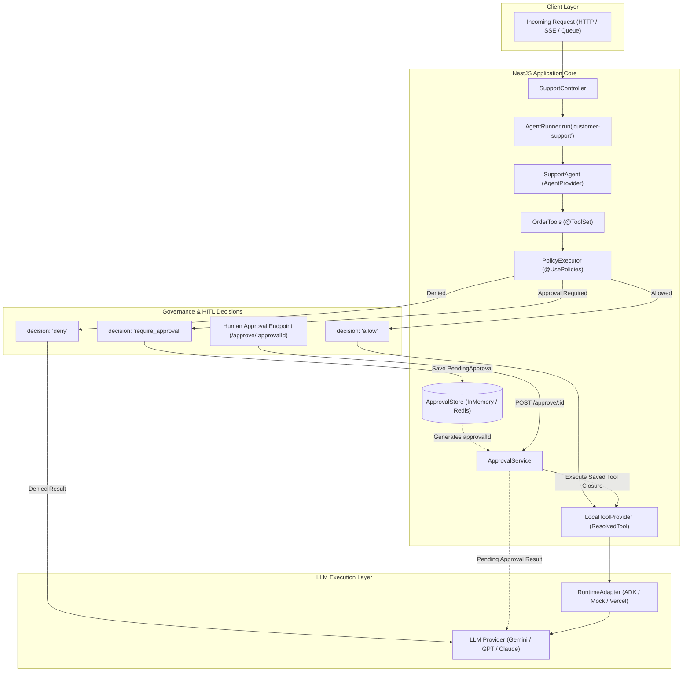
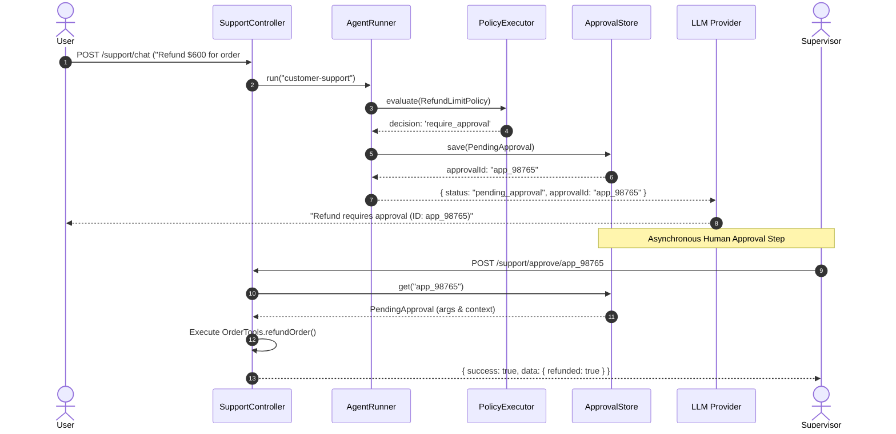

# Architecture Guide

This document details the architecture of **nestjs-agentic** as an Agentic Infrastructure & Governance Layer for NestJS, focusing on tool resolution, closure-based policy enforcement, and working Human-in-the-Loop (HITL) approval mechanics.

---

## Visual Architecture Overview



---

## Tool Closure & Policy Engine Mechanics

When `LocalToolProvider` scans a `@ToolSet` provider, it wraps each tool method into a `ResolvedTool` closure:

```
What RuntimeAdapter sees:

  tool.execute(input) → Promise<ToolExecutionResult>

Execution Pipeline inside closure:

  1. PolicyExecutor.evaluate(policies, ctx, args)
     ├── decision: 'deny'
     │    └── return { success: false, status: 'denied', reason }
     │
     ├── decision: 'require_approval'
     │    ├── PendingApproval stored in ApprovalStore (approvalId generated)
     │    └── return { success: false, status: 'pending_approval', reason, approvalId }
     │
     └── decision: 'allow'
          └── invoke target method with mapped args + injected @Context
               └── return { success: true, data }
```

---

## Human-in-the-Loop (HITL) Flow



---

## Token-based Dependency Injection

Adapters and stores are registered using standard NestJS DI Tokens:

```typescript
{ provide: RUNTIME_ADAPTER, useClass: AdkRuntimeAdapter },
{ provide: APPROVAL_STORE, useClass: InMemoryApprovalStore }
```

This allows adapters and approval stores to inject NestJS services like `ConfigService` or `HttpService` naturally.
