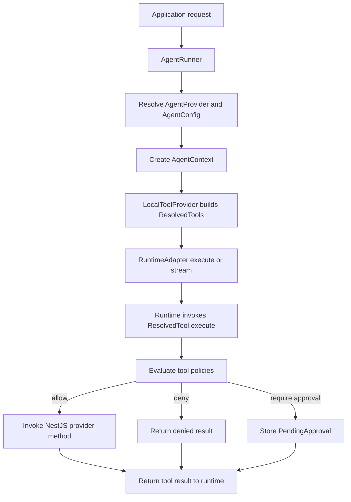
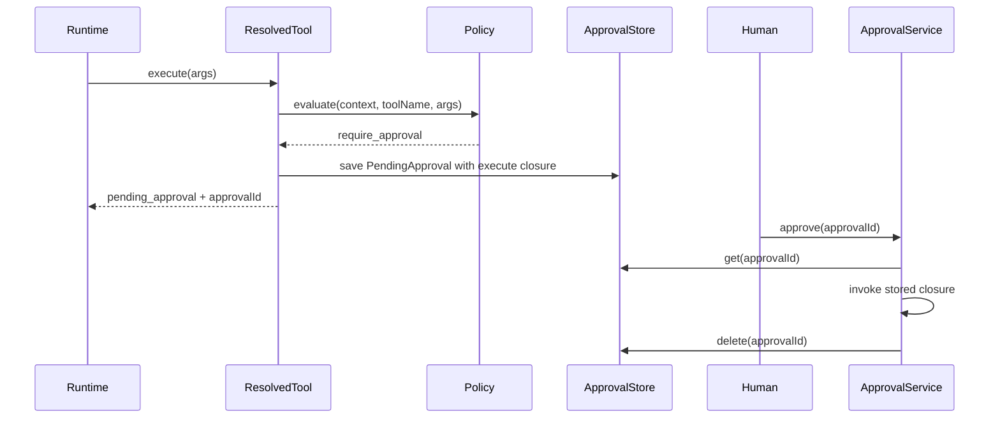
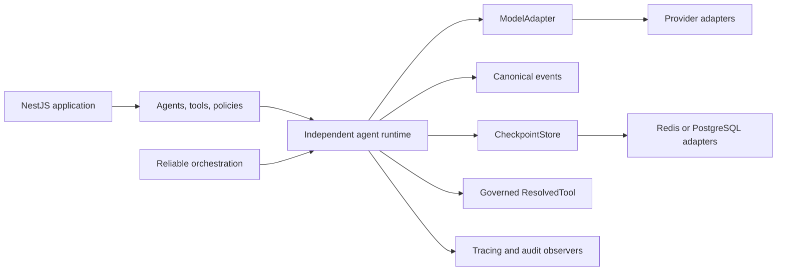

# Architecture Guide

This document describes the current architecture of **nestjs-agentic**, the boundaries that protect tool execution, and the direction of the independent runtime planned in the [product roadmap](ROADMAP.md).

## Architectural Position

nestjs-agentic is a NestJS-native runtime and governance layer for bounded AI agents. Application services remain ordinary NestJS providers. The framework discovers selected methods as tools, binds application-owned context to them, and enforces policies before a runtime can invoke their side effects.

The core package does not require a specific model provider or graph framework.

## Package Boundaries

```text
Application
    |
    +-- @nestjs-agentic/core
    |     agents, tools, policies, approvals, stores, AgentRunner
    |
    +-- optional runtime adapter
    |     @nestjs-agentic/adk
    |     @nestjs-agentic/langgraph
    |     custom RuntimeAdapter
    |
    +-- optional capability packages
          memory, experience, rag, orchestration, evaluation
```

| Package area | Responsibility |
| --- | --- |
| `core` | NestJS registration, metadata discovery, agent context, governed tools, runtime boundary, approvals, and store contracts. |
| Runtime adapters | Translate the framework runtime input to a provider or compatibility SDK. Current adapters are experimental and may not provide identical behavior. |
| `memory`, `experience`, `rag` | Opt-in cognitive and retrieval primitives. They are not automatically attached to `AgentRunner`. |
| `orchestration` | Opt-in delegation, parallel execution, fallback, and refinement built on `AgentRunner`. It is not currently a durable graph engine. |
| `evaluation` | Opt-in metrics, benchmark execution, and reporting. |

## Current Execution Path



`AgentRunner` performs the following work for each run:

1. Resolves the registered agent by name.
2. Reads its instructions, tools, and model configuration.
3. Creates an `AgentContext` containing the session, trace, security, and application data.
4. Asks `LocalToolProvider` to convert decorated NestJS methods into `ResolvedTool` closures.
5. Passes the message, tools, instructions, and model configuration to the selected `RuntimeAdapter`.

The runtime never receives raw access to NestJS tool instances or the application security context. It receives callable `ResolvedTool` objects.

## Governed Tool Boundary

A `ResolvedTool` is the main security boundary between model-driven decisions and application side effects:

```text
ResolvedTool.execute({ args })
    |
    +-- resolve configured policies
    +-- evaluate policies with AgentContext, tool name, and arguments
    |
    +-- deny
    |     return { success: false, status: 'denied', reason }
    |
    +-- require_approval
    |     save PendingApproval
    |     return { success: false, status: 'pending_approval', approvalId, reason }
    |
    +-- allow
          map arguments to the decorated method
          inject AgentContext into @Context parameter
          invoke the NestJS provider method
          return { success: true, data }
```

This design keeps policy enforcement independent of model and runtime adapters. A compliant adapter invokes the provided closure instead of calling application services directly.

## Human-in-the-Loop: Current Behavior



The current approval API protects an individual tool invocation, but it is not yet a durable workflow pause:

- continuation is stored as a process-local JavaScript closure;
- a process restart cannot reconstruct that closure;
- approval executes the pending tool but does not resume the original model turn;
- durable checkpoint and exactly-once behavior are roadmap work.

Applications should treat the current HITL implementation as experimental when restart recovery or multi-instance execution is required.

## Runtime Adapter Boundary

The current core contract is intentionally small:

```typescript
interface RuntimeAdapter {
  execute(input: AgentRunInput): Promise<AgentResult>;
  stream?(input: AgentRunInput): AsyncIterable<AgentStreamEvent>;
}
```

This keeps core independent from provider SDKs, but it does not yet standardize model messages, tool-call rounds, usage, cancellation, checkpoints, or provider errors. Consequently, current adapters can differ in behavior.

- `MockRuntimeAdapter` supports deterministic framework tests.
- `AdkRuntimeAdapter` is an experimental synthetic runtime prototype published under `@nestjs-agentic/adk`; it does not currently integrate with provider-native ADK APIs.
- `LangGraphRuntimeAdapter` supports LangChain model and LangGraph checkpointer types, but does not currently compile or execute a LangGraph `StateGraph`.

The independent runtime milestone will move common model and tool-loop behavior behind framework-owned contracts while keeping provider integrations optional.

## Streaming: Current Behavior

`AgentRunner.runStream()` exposes `AgentStreamEvent` values. If an adapter implements `stream()`, the runner delegates to it. Otherwise, the runner converts the completed `AgentResult` into tool and completion events.

The event types are shared, but current adapters do not yet guarantee equivalent token streaming, cancellation, error, approval, or ordering semantics. Canonical event behavior is part of the independent runtime roadmap.

## State, Sessions, and Memory

These concepts exist today but do not yet form one execution lifecycle:

| Concept | Current role |
| --- | --- |
| `SessionStore` | Session data contract with an in-memory default. |
| `StateStore` | General state abstraction with in-memory and Redis implementations. It can be registered through `AgenticModule`. |
| Runtime checkpointer | Adapter-specific checkpoint facility, currently separate from core stores. |
| Memory packages | Explicitly constructed short-term, semantic, episodic, and scratchpad memory primitives. |

`AgentRunner` does not currently persist or recover an execution through these stores automatically. The durable execution milestone will define clear ownership for sessions, checkpoints, memory, and audit events.

## Orchestration: Current Behavior

`@nestjs-agentic/orchestration` calls `AgentRunner` to provide:

- sub-agent delegation;
- parallel fan-out;
- retries and fallback;
- iterative refinement.

The package is intentionally separate from core and has no direct LangGraph dependency. Its current implementation is process-local and does not yet provide durable scheduling, cancellation propagation, bounded concurrency, or retry-safe side-effect guarantees.

## Target Runtime Direction



The target runtime is responsible for common execution semantics:

- model-to-tool iteration;
- argument validation;
- streaming and execution events;
- cancellation, deadlines, and budgets;
- checkpoints and resumable approval;
- consistent errors, usage, and observability.

LangGraph, Google ADK, and direct model SDKs remain optional adapters. They do not define core agent, tool, governance, or persistence contracts.

## Design Rules

1. **Application services remain ordinary NestJS providers.** Tool decorators expose selected methods without moving business logic into the framework.
2. **Every framework-managed side effect crosses a governed tool closure.** Runtime adapters must not bypass `ResolvedTool.execute()`.
3. **Identity is application-owned.** Models do not create or override tenant, user, role, or permission data.
4. **Core types remain vendor-neutral.** Provider SDK types belong in optional adapter packages.
5. **Deterministic workflows surround model decisions.** Agents handle ambiguity inside explicit application boundaries.
6. **Reliability precedes additional autonomy.** Durable state, cancellation, idempotency, and observability are prerequisites for advanced orchestration.

See [ROADMAP.md](ROADMAP.md) for milestone scope and production-readiness criteria.
