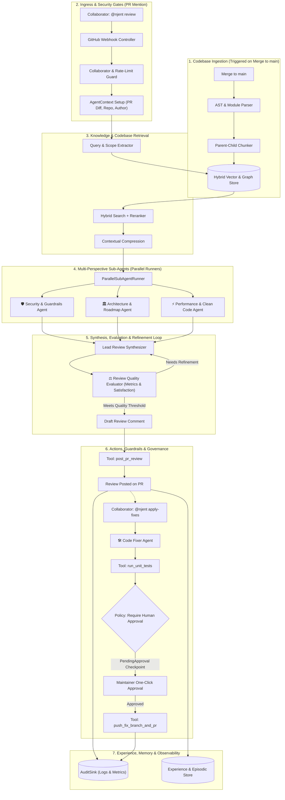

# 🤖 Njent — Autonomous Code Review & PR Governance Agent
> **The Governed Multi-Agent Code Reviewer, Architectural Compliance Guardian, and Automated Fix Engine for `nestjs-agentic`.**

---

## 🎯 Vision & Core Objectives

**Njent** (pronounced *En-jent*) is a production-grade, governed AI agent designed specifically for the `nestjs-agentic` ecosystem to autonomously review pull requests, enforce architectural standards, and propose validated code fixes.

It also serves as the **Masterclass Reference Implementation** for building enterprise-grade, production-ready AI agent systems in NestJS, demonstrating the **14 Core Pillars of Agentic Systems** with direct foundations in peer-reviewed academic literature.

---

## 📚 14-Pillar Specification & Academic Foundations

Each specification document provides conceptual foundations, seminal research citations, concrete TypeScript implementation details, and engineering trade-offs:

| # | Specification Document | Key Educational & Architectural Topics | Academic Research Foundation (arXiv) |
|---|---|---|---|
| **00** | [00-system-requirements-and-scenarios.spec.md](file:///Users/anette/Desktop/workspace/nestjs-agentic/examples/code-review-agent/specs/00-system-requirements-and-scenarios.spec.md) | GitHub PR workflows, user personas, triggers (`@njent review`, `@njent apply-fixes`), and the functional requirements matrix (FR-01 to FR-12). | PRD / Industry Standard |
| **01** | [01-foundations-and-agent-lifecycle.spec.md](file:///Users/anette/Desktop/workspace/nestjs-agentic/examples/code-review-agent/specs/01-foundations-and-agent-lifecycle.spec.md) | How LLMs work, What is an Agent, State vs. Memory vs. Knowledge vs. Context, What is a Chunk, The Governed Agent Lifecycle. | [Yao et al. (ICLR 2023) arXiv:2210.03629](https://arxiv.org/abs/2210.03629) *(ReAct)* |
| **02** | [02-tools-actions-and-mcp.spec.md](file:///Users/anette/Desktop/workspace/nestjs-agentic/examples/code-review-agent/specs/02-tools-actions-and-mcp.spec.md) | Tool calling protocol, Model Context Protocol (MCP), Native Tools vs. MCP, Deterministic conditions, Parameter schema validation. | [Schick et al. (Meta AI) arXiv:2302.04761](https://arxiv.org/abs/2302.04761) *(Toolformer)* |
| **03** | [03-agent-architecture-and-flows.spec.md](file:///Users/anette/Desktop/workspace/nestjs-agentic/examples/code-review-agent/specs/03-agent-architecture-and-flows.spec.md) | Agent flows vs. Orchestration, Nodes & edges, Sub-agent taxonomy, Dynamic agent delegation, Architectural trade-offs. | [Hong et al. (ICLR 2024) arXiv:2308.00352](https://arxiv.org/abs/2308.00352) *(MetaGPT)* |
| **04** | [04-context-engineering.spec.md](file:///Users/anette/Desktop/workspace/nestjs-agentic/examples/code-review-agent/specs/04-context-engineering.spec.md) | Context windows, "Lost in the middle", Context selection & noise stripping, Contextual compression, Sub-agent context isolation. | [Liu et al. (Stanford/Berkeley) arXiv:2307.03172](https://arxiv.org/abs/2307.03172) *(Lost in the Middle)* |
| **05** | [05-knowledge-and-rag.spec.md](file:///Users/anette/Desktop/workspace/nestjs-agentic/examples/code-review-agent/specs/05-knowledge-and-rag.spec.md) | RAG architectures, AST-aware code chunking, Parent-child hydration, Hybrid search (Dense Vector + BM25), Graph-RAG, Cross-encoder reranking. | [Lewis et al. (NeurIPS 2020) arXiv:2005.11401](https://arxiv.org/abs/2005.11401) *(RAG)* & [arXiv:2404.16130](https://arxiv.org/abs/2404.16130) *(GraphRAG)* |
| **06** | [06-memory-and-experience.spec.md](file:///Users/anette/Desktop/workspace/nestjs-agentic/examples/code-review-agent/specs/06-memory-and-experience.spec.md) | All 5 memory types (Short-term, Long-term, Semantic, Episodic, Procedural), Reflection loops, Experience records, Maintainer feedback. | [Park et al. (Stanford) arXiv:2304.03442](https://arxiv.org/abs/2304.03442) & [Shinn et al. (NeurIPS 2023) arXiv:2303.11366](https://arxiv.org/abs/2303.11366) *(Reflexion)* |
| **07** | [07-reliability-and-failure-recovery.spec.md](file:///Users/anette/Desktop/workspace/nestjs-agentic/examples/code-review-agent/specs/07-reliability-and-failure-recovery.spec.md) | Agent failure modes, Exponential retries, Idempotency stores, Timeouts & AbortSignals, Self-correction, Human-in-the-loop durability. | [Packer et al. (UC Berkeley) arXiv:2310.08560](https://arxiv.org/abs/2310.08560) *(MemGPT)* |
| **08** | [08-multi-agent-orchestration.spec.md](file:///Users/anette/Desktop/workspace/nestjs-agentic/examples/code-review-agent/specs/08-multi-agent-orchestration.spec.md) | Why multiple agents, Supervisor-worker topology, Specialist sub-agents, Parallel fan-out execution, Consensus aggregation. | [Du et al. (MIT) arXiv:2305.14325](https://arxiv.org/abs/2305.14325) & [Li et al. arXiv:2402.05120](https://arxiv.org/abs/2402.05120) *(More Agents)* |
| **09** | [09-evaluation-quality-gates.spec.md](file:///Users/anette/Desktop/workspace/nestjs-agentic/examples/code-review-agent/specs/09-evaluation-quality-gates.spec.md) | Why agent evaluation is different, Step-level vs. Trajectory evaluation, LLM-as-a-Judge rubrics, Automated test validation, Benchmarks. | [Zheng et al. (NeurIPS 2023) arXiv:2306.05685](https://arxiv.org/abs/2306.05685) *(LLM-as-a-Judge)* |
| **10** | [10-observability-and-monitoring.spec.md](file:///Users/anette/Desktop/workspace/nestjs-agentic/examples/code-review-agent/specs/10-observability-and-monitoring.spec.md) | Multi-turn semantic tracing, Structured audit sinks, Token & cost monitoring, Latency metrics, Prometheus/OTel schemas. | [OpenTelemetry GenAI Semantic Conventions](https://opentelemetry.io/docs/specs/semconv/gen-ai/) |
| **11** | [11-security-and-guardrails.spec.md](file:///Users/anette/Desktop/workspace/nestjs-agentic/examples/code-review-agent/specs/11-security-and-guardrails.spec.md) | Threat taxonomy, Indirect prompt injection defense, XML boundary delimitation, Collaborator RBAC, Pre-egress secret redaction. | [Greshake et al. (USENIX 2023) arXiv:2302.12173](https://arxiv.org/abs/2302.12173) & [NVIDIA arXiv:2310.10501](https://arxiv.org/abs/2310.10501) |
| **12** | [12-governance-and-policies.spec.md](file:///Users/anette/Desktop/workspace/nestjs-agentic/examples/code-review-agent/specs/12-governance-and-policies.spec.md) | Code boundaries vs. prompt instructions, Policy engine (`allow`/`deny`/`require_approval`), Suspension checkpoints, Settlement APIs. | [NIST AI Risk Management Framework 1.0](https://doi.org/10.6028/NIST.AI.100-1) |
| **13** | [13-performance-and-optimization.spec.md](file:///Users/anette/Desktop/workspace/nestjs-agentic/examples/code-review-agent/specs/13-performance-and-optimization.spec.md) | Latency-cost-quality triangle, Model tiering & routing, Prompt KV-caching, Bounded concurrency fan-out. | [Chen et al. (Stanford) arXiv:2305.05176](https://arxiv.org/abs/2305.05176) *(FrugalGPT)* |
| **14** | [14-production-agent-systems.spec.md](file:///Users/anette/Desktop/workspace/nestjs-agentic/examples/code-review-agent/specs/14-production-agent-systems.spec.md) | The 5 production pillars, Distributed recovery in Kubernetes, BullMQ queue decoupling, Continuous improvement loops. | [Xi et al. arXiv:2309.07864](https://arxiv.org/abs/2309.07864) *(Agent Survey)* & [Madaan et al. arXiv:2303.17651](https://arxiv.org/abs/2303.17651) |

---

## 🏗️ High-Level Architecture



---

## 🚀 Commands Quick Reference

```bash
# Request standard review from all sub-agents
@njent review

# Review only security and guardrail violations
@njent check-security

# Check adherence to nestjs-agentic architecture patterns & roadmap
@njent check-architecture

# Generate and apply validated fix commits for reported issues
@njent apply-fixes
```

---

## 📁 Directory Structure, Design & Tasks Mapping

```
examples/code-review-agent/
├── README.md                                   # Master overview and educational index
├── package.json                                # Dependencies and run scripts
├── tsconfig.json
│
├── specs/                                      # 📚 14-Pillar Specification & Masterclass
│   ├── 00-system-requirements-and-scenarios.spec.md
│   ├── 01-foundations-and-agent-lifecycle.spec.md
│   ├── 02-tools-actions-and-mcp.spec.md
│   ├── 03-agent-architecture-and-flows.spec.md
│   ├── 04-context-engineering.spec.md
│   ├── 05-knowledge-and-rag.spec.md
│   ├── 06-memory-and-experience.spec.md
│   ├── 07-reliability-and-failure-recovery.spec.md
│   ├── 08-multi-agent-orchestration.spec.md
│   ├── 09-evaluation-quality-gates.spec.md
│   ├── 10-observability-and-monitoring.spec.md
│   ├── 11-security-and-guardrails.spec.md
│   ├── 12-governance-and-policies.spec.md
│   ├── 13-performance-and-optimization.spec.md
│   └── 14-production-agent-systems.spec.md
│
├── design/                                     # 🏛️ Architecture Decision Records (ADRs) & Diagrams
│   ├── adr-001-hybrid-rag-postgres.md           # RAG, AST Splitting, pgvector & BM25 RRF
│   ├── adr-002-supervisor-react-orchestration.md# Supervisor-Worker Fan-Out & MetaGPT SOPs
│   ├── adr-003-governance-hitl-redis-checkpoints.md # Human-in-the-Loop & Redis NX Idempotency
│   ├── adr-004-security-tri-rail-guardrails.md   # Tri-Rail Guardrails & Canary Tokens
│   ├── adr-005-mcp-sandboxed-execution.md       # Model Context Protocol (MCP) in Docker
│   ├── adr-006-evaluation-debiased-judge.md     # Pre-Egress Position-Debiased Quality Gate
│   ├── adr-007-memory-stanford-reflexion.md     # 5-Tier Memory & Stanford Tri-Factor Scoring
│   ├── adr-008-observability-frugal-performance.md # OpenTelemetry & FrugalGPT Cascading
│   └── sequence-diagrams.md                     # Comprehensive Mermaid Sequence Flows
│
├── tasks/                                      # 📝 Implementation Tasks & Verification Matrix
│   ├── implementation-tasks.md                  # Master Task Matrix & Test Plan
│   ├── task-01-ingress-security-context.md      # Webhook, HMAC, RBAC, Context Pruning
│   ├── task-02-ast-rag-hybrid-search.md         # AST ts-morph Chunker, pgvector, GraphRAG
│   ├── task-03-specialist-reviewer-agents.md    # Security, Arch, Quality, Synthesizer, Fixer
│   ├── task-04-orchestration-and-consensus.md   # Parallel Fan-Out, Consensus, Frugal Cascade
│   ├── task-05-governance-hitl-idempotency.md   # Policies, Redis Checkpoints & Settlement
│   ├── task-06-evaluation-and-mcp-sandbox.md    # Debiased Judge, Docker MCP Sandbox
│   ├── task-07-memory-experience-observability.md # Stanford Memory, Reflexion, OTel Audit
│   └── task-08-e2e-testing-and-verification.md  # E2E Test Suite & Contract Tests
│
└── src/                                        # 💻 Source Code Implementation
```
