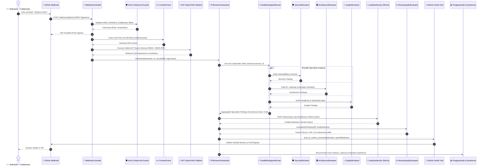
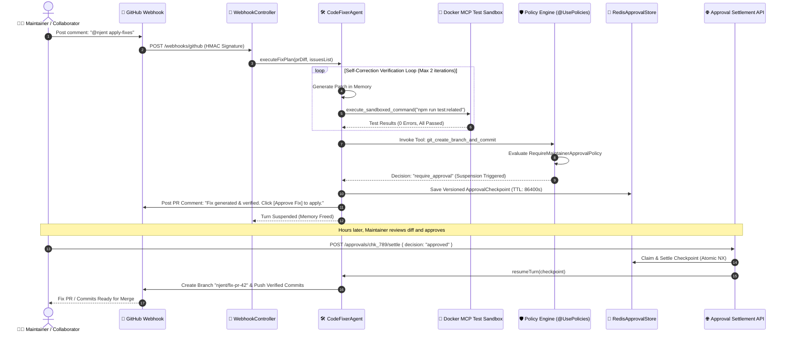

# Detailed Sequence Diagrams for Njent

> **Comprehensive Mermaid sequence diagrams detailing multi-agent interactions, RAG retrieval, quality gates, and governed human-in-the-loop executions.**

---

## 1. Full PR Review Flow (`@njent review`)

---

## 2. Automated Code Fix Flow & Human Approval Settlement (`@njent apply-fixes`)

