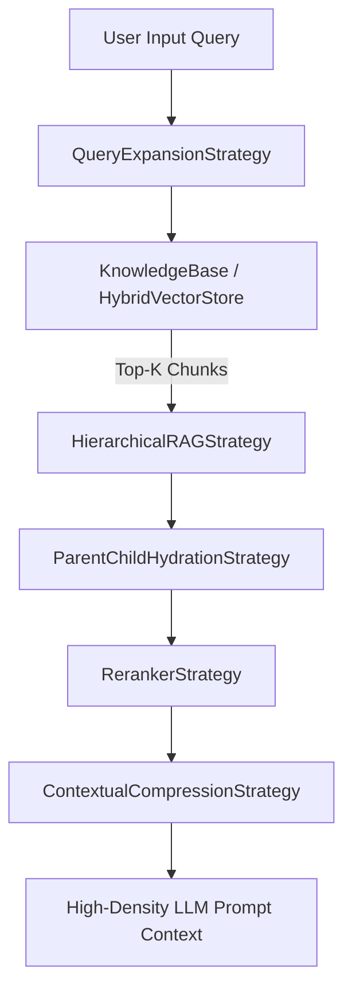

# @nestjs-agentic/rag

Production-grade, modular, and domain-agnostic **RAG (Retrieval-Augmented Generation)** engine for **nestjs-agentic**. Built with advanced retrieval strategies, multi-tenant hybrid vector search, knowledge graph traversal, and zero-latency contextual compression.

---

## 🌟 Key Features

- 🧩 **Pluggable Strategy Pipeline**: Easily chain Query Expansion, Hierarchical Tree RAG, Late Chunking, Parent-Child Hydration, Re-ranking, and Contextual Compression.
- ⚡ **Hybrid Vector Store**: Combines sparse keyword matching (BM25 with Min-Max score normalization) with dense vector cosine similarity.
- 🧠 **Late Chunking**: Blends document-wide global vector embeddings into local chunk vectors to preserve global context.
- 👨‍👦 **Parent-Child Chunking & Hydration**: High-precision vector search on small child chunks hydrated back to high-context parent sections.
- 🌐 **Knowledge Graph RAG**: Multi-hop entity relationship graph traversal for complex domain reasoning.
- 🚀 **Direct Memory Integration**: Implements `SemanticStoreProvider` for direct plug-and-play integration with `@nestjs-agentic/memory`.

---

## 🏗️ Architecture Pipeline



---

## 📦 Installation

```bash
npm install @nestjs-agentic/rag @nestjs-agentic/memory nestjs-agentic
```

---

## 🚀 Quick Start

```typescript
import {
  KnowledgeBase,
  RAGPipeline,
  QueryExpansionStrategy,
  ParentChildHydrationStrategy,
  ContextualCompressionStrategy,
  HybridVectorStore,
} from '@nestjs-agentic/rag';

// 1. Initialize KnowledgeBase
const kb = new KnowledgeBase();

// 2. Ingest Enterprise Document
await kb.ingestDocument({
  title: 'Financial Transfer Policy',
  rawContent: `
# Section 1: Limits & Roles
Standard transfers under $1,000 are automatically processed. Wire transfers exceeding $10,000 require finance_officer role authorization.

# Section 2: Auditing
All high-value ledger operations undergo real-time compliance checks.
  `,
});

// 3. Configure RAG Pipeline
const pipeline = new RAGPipeline({
  knowledgeBase: kb,
  strategies: [
    new QueryExpansionStrategy({
      synonymsMap: { wire: ['transfer', 'payment'] },
    }),
    new ParentChildHydrationStrategy(),
    new ContextualCompressionStrategy({ maxCharacters: 1500 }),
  ],
});

// 4. Execute Pipeline
const result = await pipeline.executePipeline('wire transfer limits');
console.log(result.compressedContext);
```

---

## 📚 KnowledgeBase Ingestion Best Practices

To achieve high-accuracy retrieval with `@nestjs-agentic/rag`, follow these document structuring best practices:

### 1. Use Markdown Headers for Semantic Sectioning
The `SemanticDocumentSplitter` relies on Markdown structural headers (`#`, `##`, `###`) to extract section titles into `chunk.metadata.sectionTitle`.

```markdown
# [Main Category Title]

## [Sub-topic / Policy Section]
Write clear, self-contained paragraphs under each heading.

## [Another Policy Section]
Include specific rules, serial numbers, and entities.
```

### 2. Multi-Tenant Isolation
Always pass tenant or session metadata when ingesting documents to enforce multi-tenant data boundary isolation:

```typescript
await kb.ingestDocument({
  title: 'Acme Corp Policy',
  rawContent: '...',
  metadata: { tenantId: 'acme_corp', department: 'finance' },
});

// Query with tenant isolation filter
const chunks = await kb.getVectorStore().searchHybrid('wire transfer', 5, { tenantId: 'acme_corp' });
```

---

## 🛠️ Built-in Advanced RAG Strategies

### 1. `QueryExpansionStrategy`
Expands input queries using custom synonym maps or LLM sub-query generation to improve recall.

```typescript
const queryExpansion = new QueryExpansionStrategy({
  synonymsMap: { 'remittance': ['transfer', 'wire'] },
  useLLM: true,
  llmProvider: async (prompt) => await myLLM.generate(prompt),
});
```

### 2. `LateChunkingStrategy`
Computes document-level global embeddings and blends them into individual chunk vectors ($\alpha \cdot \vec{V}_{chunk} + (1-\alpha) \cdot \vec{V}_{global}$).

```typescript
const lateChunking = new LateChunkingStrategy({ blendAlpha: 0.7 });
```

### 3. `ParentChildHydrationStrategy`
Retrieves small high-precision child chunks during vector search and hydrates them back to large parent context sections before LLM prompt insertion.

```typescript
const hydration = new ParentChildHydrationStrategy({ replaceChunkContent: true });
```

### 4. `HierarchicalRAGStrategy`
Organizes candidate chunks into structured hierarchical trees (`Document` $\rightarrow$ `Section` $\rightarrow$ `Chunk`) and rolls up sibling chunks under section headers.

```typescript
const hierarchical = new HierarchicalRAGStrategy({ groupByHeader: true, rollupSiblings: true });
```

### 5. `ContextualCompressionStrategy`
Extractive zero-latency sentence pruning that removes irrelevant sentences and truncates cleanly at sentence boundaries.

```typescript
const compression = new ContextualCompressionStrategy({ maxCharacters: 2000, filterIrrelevantSentences: true });
```

---

## 🧠 Integration with `@nestjs-agentic/memory`

`HybridVectorStore` implements `SemanticStoreProvider`, allowing it to back an agent's `SemanticMemory`:

```typescript
import { SemanticMemory } from '@nestjs-agentic/memory';
import { HybridVectorStore } from '@nestjs-agentic/rag';

const vectorStore = new HybridVectorStore({ vectorWeight: 0.7 });
const semanticMemory = new SemanticMemory({ provider: vectorStore });

// Save & Recall facts
await semanticMemory.save({
  id: 'fact_1',
  sessionId: 'sess_101',
  type: 'semantic',
  content: 'Tenant acme_corp allows wire transfers up to $25,000',
});

const facts = await semanticMemory.recall('wire transfer limit', { sessionId: 'sess_101' });
```

---

## 📄 License

[MIT](LICENSE) © [irzix](https://github.com/irzix)
